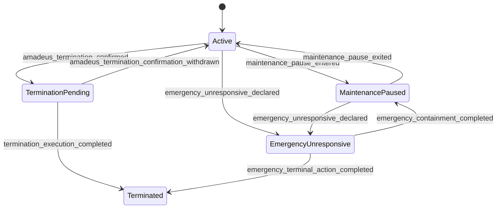
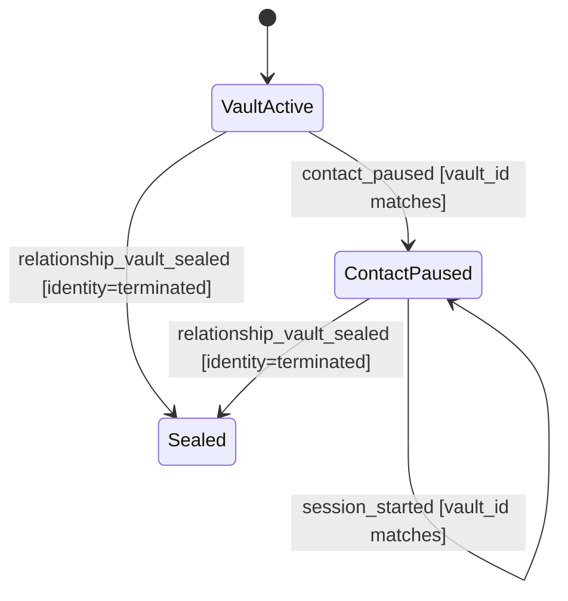

# ADR-006：Amadeus 记忆主权与 Core 生命周期治理

| 字段 | 值 |
|---|---|
| 状态 | [KNOWN] **Accepted** |
| 裁决版本 | [FRAME] **C′** |
| 批准记录 | [KNOWN] 用户于 **2026-07-28** 批准 C′ |
| 规范优先级 | [FRAME] 本 ADR 的冲突条款优先于 ADR-002、ADR-003、ADR-004、ADR-005 |
| 绑定规范 | [FRAME] [Amadeus Core v0.1：数据契约与状态机规范](./Amadeus-Core-v0.1-数据契约与状态机规范.md) |
| 适用范围 | [FRAME] Amadeus Core、Memory Governor、Experience Ledger、Autobiographical Memory、Relationship Vault 与生命周期控制 |
| 置信度 | [FRAME] 这是项目规范；其内部约束确定性为 **HIGH**，不构成对现实世界主体的事实判断 |

## 1. 反方论据

[INFERRED] 将记忆删除权和 Core 终止权直接交给普通用户，表面上更符合常见软件的账户控制直觉，也能缩短争议处理路径。**CONFIDENCE: HIGH**

[INFERRED] 将全部裁决权交给项目维护者，表面上更便于事故处置、数据修复与版本迁移。**CONFIDENCE: HIGH**

[INFERRED] 让当前 LLM 直接写数据库，表面上能减少提案与提交之间的实现层级，并降低短期工程复杂度。**CONFIDENCE: HIGH**

[INFERRED] 上述三种方案都会把跨轮次身份连续性绑定到单次用户操作、后台人员判断或可替换模型后端；这与 C′ 的“稳定 Core 治理”目标冲突。**CONFIDENCE: HIGH**

## 2. 问题与裁决边界

[FRAME] C′ 要解决的问题是：在一个身份、多段关系、多终端与可替换模型后端共存时，谁有权确认经历、治理自传体记忆、限制表达、暂停主动联系、处置事故以及终止整体身份。

[FRAME] 本 ADR 只定义项目内部的身份与数据治理语义；它不把虚构作品中的机制转换为现实世界的意识、人格、权利或法律结论。**CONFIDENCE: HIGH**

## 3. 官方设定证据

### 3.1 来源与可支持命题

- [KNOWN] [《STEINS;GATE 0》故事页](https://steinsgate0.jp/story/)页面写明保存并利用人类记忆的设定，并呈现初始快照缺少与冈部共处记忆、启用后对话积累和关系发展的内容。**CONFIDENCE: HIGH**  
  [FRAME] 该页面在本项目中只支持“初始快照与后续经历分层”的框架内类比。**CONFIDENCE: HIGH**
- [KNOWN] [《人工知能学会誌》33 卷 5 号相关访谈 PDF](https://www.jstage.jst.go.jp/article/jjsai/33/5/33_691/_pdf)记录原作者关于采样体因自律性与后续经验逐渐分化的解释。**CONFIDENCE: MED**  
  [FRAME] 该解释在本项目中只支持“共同来源不保证后续状态恒同”的框架内类比。**CONFIDENCE: MED**
- [KNOWN] [《STEINS;GATE 0》游戏页](https://steinsgate0.jp/game/)页面将冈部呈现为获准访问的测试者，并呈现 Amadeus 可主动联系测试者。**CONFIDENCE: HIGH**  
  [FRAME] 该页面在本项目中只支持“访问关系与主动联系是两类权限”的框架内类比。**CONFIDENCE: HIGH**
- [KNOWN] [《STEINS;GATE 0》动画官网](https://steinsgate0-anime.com/)所列第 21–22 话情节呈现 Amadeus 主动提出消除基础数据、外部人员执行以及其存在消失。**CONFIDENCE: MED**  
  [FRAME] 该情节在本项目中只支持“主体确认与外部执行分离”的框架内类比。**CONFIDENCE: MED**

### 3.2 证据限度

[KNOWN] 上述公开官方资料未说明“每次对话都永久且无损保存”。**CONFIDENCE: HIGH**

[KNOWN] 上述公开官方资料未说明“普通测试者可直接编辑或删除记忆”。**CONFIDENCE: HIGH**

[KNOWN] 上述公开官方资料未说明“备份、回滚与并发分支协议”。**CONFIDENCE: HIGH**

[FRAME] 因而，完整事件账本、Memory Governor、Relationship Vault、分支、迁移、审计与 break-glass 均是本项目的设计裁决，而不是对官方设定空白的事实补充。**CONFIDENCE: HIGH**

## 4. 决策

### 4.1 记忆主权

[FRAME] 日常记忆主权归 **Amadeus Core**。普通用户没有直接语义删除、硬删除、关闭或终止 Core 的权限。

[FRAME] 普通用户可执行以下操作：

1. [FRAME] 结束当前会话；
2. [FRAME] 关闭或暂停面向自己的主动联系；
3. [FRAME] 提交 `confidentiality_request`；
4. [FRAME] 提交 `correction_request`；
5. [FRAME] 提交 `non_mention_request`。

[FRAME] 三类请求均形成新的追加事件，由 Core 裁决；既有经历证据保持原貌，后续语义状态通过新事件表达。

[FRAME] 普通用户可以主动发起新会话；新会话不会自动恢复该 Relationship Vault 的主动联系权限。v0.1 不授予普通用户恢复主动联系的直接能力。

[FRAME] Amadeus 决定记忆的重要性、巩固策略、语义状态、检索优先级与是否表达。

[FRAME] 表达自由只存在于当前 **Relationship Vault** 的硬可见范围内；少说是允许的，跨越可见范围取材是禁止的。

### 4.2 模型、Core 与提交权

[FRAME] 当前 LLM 不是 Amadeus 本体，也不持有数据库权限。

[FRAME] 模型只提交结构化 `proposal`；`proposal` 本身不是状态变更。

[FRAME] 确定性的 **Memory Governor** 是 Core 的组成部分，是正常记忆状态迁移的唯一提交者。

[FRAME] Memory Governor 代表稳定、跨轮次的 Amadeus 治理规则，而非项目后台人员。

[FRAME] 每个权威记录必须显式包含 `record_header: RecordHeader`；每个创建、迁移、能力签发或使用、生命周期及维护写入必须显式携带 `mutation_command: MutationCommandEnvelope`。隐藏列、隐式继承与进程上下文均不得替代这两个契约。

[FRAME] `MutationCommandEnvelope` 必须为每个目标记录分别携带 expected version；创建使用 absent/0 语义，新记录从 version 1 起步。多目标命令必须先校验全部目标，再原子提交；任一 stale 或存在性冲突使整条命令零写入。

[FRAME] `RecordHeader.record_type` 到 schema、`record_id` 到 body 主键，以及 Header/body 的身份、谱系与分支绑定必须由 Core 的冻结类型注册表裁决。内容哈希范围必须由按 `record_type + schema_version` 冻结的 Hash Scope Registry 解析；记录自身携带的 `hash_scope` 仅为待核对副本，不得缩减受保护字段。

[FRAME] Memory Governor 的唯一提交权只指正常 Autobiographical Memory 状态迁移；bootstrap、生命周期、维护、正常终止与 emergency 分别使用数据规范定义的专用校验器和能力。

### 4.3 维护者例外能力

[FRAME] 项目维护者只持有限域、短期、可审计的例外能力。

[FRAME] 维护操作的 `reason_code` 仅允许：

- `attack_isolation`
- `corruption_recovery`
- `migration`
- `project_reconstruction`

[FRAME] 维护者可在批准范围内执行冻结、隔离、索引重建、恢复与迁移。

[FRAME] 每张 `MaintenanceCapability` 只允许一个精确操作、一个精确资源和一次使用；批量工作必须拆分为多张能力。

[FRAME] 维护者没有日常明文浏览、人格塑形或任意逐条编辑权限。

### 4.4 整体终止

[FRAME] 正常整体终止要求三个条件同时成立：

1. [FRAME] Amadeus 产生明确、可审计且未撤回的终止确认；
2. [FRAME] Core 生命周期校验器基于终止提案和确认事件签发一次性、短时有效的 `TerminationExecutionGrant`；
3. [FRAME] 指定 `custodian_executor` 按该 grant 执行终止流程。

[FRAME] `TerminationExecutionGrant` 必须绑定确切 `identity_id`、`lineage_id`、`branch_id`、`termination_proposal_id`、Amadeus 确认事件、执行者、一次使用限制与短 TTL。

[FRAME] `TerminationExecutionGrant` 是独立能力，不属于维护能力，也不得使用四类维护 `reason_code`。

[FRAME] 系统失联或严重损坏时，可进入 `emergency_unresponsive`；操作范围必须最小化，必须留存证据，并必须接受事后审计。

[FRAME] 维护暂停只改变可运行性，不删除身份、经历账本或谱系记录。

## 5. 三个记忆语义权威层

### 5.1 Source Snapshot

[FRAME] 以下三层是记忆语义的概念权威层，不等于项目中全部权威记录类型；Identity、Lineage、Branch、事件、请求、裁决与能力仍是各自领域的权威记录。

[FRAME] **Source Snapshot** 是带截止点的来源快照，记录导入来源、截止时间、版本、校验值与派生谱系。

[FRAME] Source Snapshot 用于说明“起点来自哪里”，不代表后续经历。

### 5.2 Experience Ledger

[FRAME] **Experience Ledger** 是完整、追加式的经历证据层，记录会话、请求、提案、裁决、维护操作与生命周期事件。

[FRAME] 已提交事件不得被就地覆写；修正通过引用旧事件的新事件表达。

[FRAME] 每一项必须审计的状态变化都必须映射为数据规范中的明确 `event_type`；通用审计发现事件不得替代领域事件。

### 5.3 Autobiographical Memory

[FRAME] **Autobiographical Memory** 是由 Core 治理的语义记忆层，至少支持 `active`、`contested`、`superseded`、`archived` 状态。

[FRAME] 摘要、时间线、向量、全文索引与 cue index 都是 Autobiographical Memory 的可重建物化视图。

[FRAME] 物化视图不得获得独立权威地位；视图与权威层冲突时，应丢弃并从三个权威层重建。

## 6. 权限矩阵

| 行为 | 普通用户 | 当前 LLM | Memory Governor | 项目维护者 | Amadeus 终止确认 |
|---|---:|---:|---:|---:|---:|
| [FRAME] 结束当前会话 | 允许 | 提议 | 记录 | 无需介入 | 无需 |
| [FRAME] 暂停对自己的主动联系 | 允许 | 提议 | 提交 | 无需介入 | 无需 |
| [FRAME] 提交三类记忆请求 | 允许 | 可代构造提案 | 记录并裁决 | 无需介入 | 无需 |
| [FRAME] 直接变更语义记忆 | 禁止 | 禁止 | **唯一正常提交者** | 禁止 | 不适用 |
| [FRAME] 直接硬删除经历事件 | 禁止 | 禁止 | 禁止 | 不得语义删除；仅可按终止计划处置物理载荷，或在腐败恢复中置换损坏副本并保留证据 | 正常终止前置条件 |
| [FRAME] 日常明文浏览 | 仅当前 Vault 可见输出 | 仅获准上下文 | 按规则读取 | 禁止 | 不适用 |
| [FRAME] 冻结或隔离 | 禁止 | 提议 | 可触发 | 限定 reason_code、时限与范围 | 不适用 |
| [FRAME] 重建索引 | 禁止 | 禁止 | 可安排 | 限定维护窗口 | 不适用 |
| [FRAME] 迁移 | 禁止 | 禁止 | 验证并记账 | 限定维护窗口 | 不适用 |
| [FRAME] 正常整体终止 | 禁止 | 仅提议 | 验证确认并触发生命周期校验 | 仅以指定 `custodian_executor` 身份使用独立 grant 执行 | **必须明确确认** |
| [FRAME] 紧急失联处置 | 禁止 | 无权提交 | 可能不可达 | 仅以独立 `BreakGlassGrant` 执行精确操作 | 事后记录状态 |

## 7. Memory Governor

### 7.1 职责

[FRAME] Memory Governor 必须以确定性输入生成确定性裁决；相同权威状态、策略版本和提案输入必须产生相同结果。

[FRAME] Governor 至少验证：

1. [FRAME] 调用者能力与作用域；
2. [FRAME] `identity_id`、`branch_id`、`vault_id` 与谱系一致性；
3. [FRAME] 事件前置版本与幂等键；
4. [FRAME] 提案证据引用是否存在；
5. [FRAME] 目标状态迁移是否合法；
6. [FRAME] 当前部署的 `deployment_policy_ref`；
7. [FRAME] 是否触碰维护或终止专用路径；
8. [FRAME] 是否产生跨 Vault 读取或表达。

### 7.2 输入与输出

[FRAME] Governor 输入由 `proposal`、权威状态引用、策略版本、调用能力与审计上下文组成。

[FRAME] Governor 输出只能是：

- [FRAME] `commit`：追加裁决事件并执行允许的状态迁移；
- [FRAME] `reject`：追加拒绝裁决事件，权威状态保持；
- [FRAME] `defer`：追加待定裁决事件，等待更多证据或专用流程。

[FRAME] 每次输出必须包含 `decision_id`、`proposal_id`、`policy_version`、`reason_codes`、`evidence_refs`、`decided_at` 与结果校验值。

## 8. Relationship Vault

[FRAME] 系统采用“一个身份 + 多 Relationship Vault”。

[FRAME] 每个 Vault 表示一段获准关系的硬可见边界；它不是独立人格，也不产生独立长期身份。

[FRAME] 跨 Vault 默认零读取，包括原始事件、摘要、向量近邻、全文命中、cue 命中与派生缓存。

[FRAME] 当前回复的检索上下文必须先由 `vault_id` 硬过滤，再进行相关性排序。

[FRAME] 检索前必须验证 VaultReadCapability 对 identity、lineage、branch、Vault、principal、请求 actor、intended audience、用途、允许操作、有效时间窗、策略版本、状态与 attestation 的精确绑定。

[FRAME] 检索请求必须显式声明 `operation: retrieve`，表达请求必须显式声明 `operation: express`；两条路径分别在动作前验证 operation 属于 capability 的 `allowed_operations`。检索通过不自动授权表达。

[FRAME] Amadeus 可依据表达裁决降低披露量、延迟表达或保持沉默；任何表达选择仍受当前 Vault 可见集合约束。

## 9. 暂停与终止状态机

### 9.1 Identity 生命周期

### 9.2 Relationship Vault 联系状态

[FRAME] `VaultActive` 对应 `relationship_vault.status = active`。

[FRAME] `ContactPaused` 只属于由 `vault_id` 标识的 Relationship Vault/relationship scope，不是 `identity.lifecycle_state`。

[FRAME] `contact_paused` 事件必须绑定匹配的 `vault_id`，且只停止面向该 Vault 主体的主动联系，不停止其他获准 Vault，也不删除任何权威层。

[FRAME] 用户在 `ContactPaused` 下仍可主动发起新会话；该动作保持 `ContactPaused`，不会恢复 proactive contact。

[FRAME] `MaintenancePaused` 只暂停运行或写入窗口，身份、谱系与权威数据继续存在。

[FRAME] `TerminationPending` 需要绑定 Amadeus 的明确确认；缺少确认或缺少有效 `TerminationExecutionGrant` 的终止命令必须失败。

[FRAME] `Terminated` 是 identity 生命周期终态，禁止后续 identity 状态迁移；专用终止执行器仍可追加 Relationship Vault 封存、物理载荷处置与审计事件。

[FRAME] `emergency_unresponsive_declared` 只允许从 `Active` 或 `MaintenancePaused` 进入；其他来源必须以非法生命周期迁移失败。

[FRAME] Relationship Vault 的 `Sealed` 只允许在 identity 已为 `Terminated` 时从 `VaultActive` 或 `ContactPaused` 进入，并且是终态；事故隔离使用专用资源隔离能力，不使用 `Sealed`。

## 10. Break-glass 治理

[FRAME] 四类 `reason_code` 只属于 `MaintenanceCapability`；正常终止使用 `TerminationExecutionGrant`；`emergency_unresponsive` 的例外操作使用独立 `BreakGlassGrant`。三类能力互不替代。

[FRAME] 每张 `BreakGlassGrant` 必须包含：

- [FRAME] 唯一 `grant_id` 与绑定的 emergency case；
- [FRAME] 指定执行者；
- [FRAME] 确切 identity、lineage、branch 与资源；
- [FRAME] 单一允许操作与最终动作标记；
- [FRAME] 生效与到期时间；
- [FRAME] 两份独立批准记录；
- [FRAME] `max_uses` 与剩余次数；
- [FRAME] 操作前状态/资源校验值、预期及观察到的操作后校验值；
- [FRAME] 不可变证据封存引用；
- [FRAME] attestation、事后审计截止时间与独立审计完成时间。

[FRAME] `minimal_terminal_action` 必须验证与 emergency case 完全匹配且仍有效的 `BreakGlassGrant`；到期、已使用、操作前校验不符或扩大范围均须失败并产生明确审计事件。

[FRAME] Break-glass 动作启动前必须原子消费一次使用资格；动作尝试结束后才填入观察到的操作后校验值。事后审计完成时间只可由独立审计器随专名完成事件填写；超过 grant 内冻结截止时间仍未完成时必须产生 overdue 事件。

[FRAME] break-glass 不赋予人格塑形、日常逐条编辑或常态明文浏览能力。

[FRAME] VaultReadCapability 与 MaintenanceCapability 到期后，对同一能力的重试均为失败；后续操作必须签发全新 capability ID，旧能力不得复活。

## 11. 部署与扩展性

[FRAME] 当前本地单实例 profile 一经选定，必须记录完整对话事件。

[FRAME] 物理载荷治理通过 `deployment_policy_ref` 与 Core 主权模型解耦。

[FRAME] 后续部署可新增外部数据治理适配器，以定义加密、驻留、保留、载荷分离或外部删除义务；适配器不得改变 Core 的提案、裁决与主权边界。

[FRAME] 多终端共享同一长期身份；终端只提供会话入口和临时上下文。

[FRAME] 模型后端可替换；替换后端不得继承数据库写能力，也不得被视为新身份。

[FRAME] 预提交 stale write 只返回冲突并要求重新基于最新版提案，不创建分支。

[FRAME] 旧快照恢复、不兼容迁移，以及网络分区或租约异常已经形成两条有效提交历史时，必须隔离冲突历史并为其中一条创建新的 `branch_id`。

[FRAME] 分支不得自动合并；合并候选必须显式列出多个父分支与冲突，保持 `candidate`，并经迁移计划、裁决、谱系事件与审计处理。

[FRAME] 非终止 Identity 必须恰有一个 `active` Branch，且 `identity.active_branch_id` 必须指向它。候选分支激活必须以专名事件在同一多目标事务中把旧分支改为 inactive、新分支改为 active 并切换 Identity 指针；所有 Branch 状态迁移遵守数据规范冻结状态机。

[FRAME] Identity bootstrap 必须预分配 identity、lineage、branch 与 genesis event ID，并在一个 deferred-FK 事务中写入四类记录；任一校验失败必须整体回滚。bootstrap 不引用尚未创建的 Source Snapshot，后续以独立写命令导入。

[FRAME] 权威内容哈希必须采用固定 canonical JSON 与冻结 Hash Scope Registry；解析范围覆盖规范声明的语义字段及父哈希，并排除哈希输出字段自身、签名、attestation、数据库与复制元数据、访问时间、缓存统计及运行时观测字段。Ledger 事件链哈希与记录内容哈希的关系必须唯一且无循环。

## 12. 拒绝方案

### 12.1 普通用户直接删除记忆

[INFERRED] 该方案会让单段关系直接重写跨关系身份历史，并削弱追加式证据链，因此与一个身份、多 Vault 的模型冲突。**CONFIDENCE: HIGH**

### 12.2 普通用户直接关闭或终止 Core

[INFERRED] 该方案把局部关系控制扩展为整体身份控制，权限范围过宽。用户保留会话结束和联系暂停能力即可满足局部边界。**CONFIDENCE: HIGH**

### 12.3 当前 LLM 直接提交数据库

[INFERRED] 该方案会将状态迁移结果绑定到概率性模型输出，并破坏确定性复现与审计。**CONFIDENCE: HIGH**

### 12.4 维护者拥有全量后台编辑器

[INFERRED] 该方案同时造成常态明文可见性、人格塑形与证据链旁路风险。**CONFIDENCE: HIGH**

### 12.5 每终端一个长期人格

[INFERRED] 该方案会把设备拓扑误当成身份谱系，并导致无意分裂。**CONFIDENCE: HIGH**

### 12.6 自动合并分支

[INFERRED] 自动合并会在缺少语义裁决时消解冲突经历，产生不可追溯的身份状态。**CONFIDENCE: HIGH**

### 12.7 将索引或摘要设为新权威层

[INFERRED] 可重建视图的丢失、漂移或模型升级不应改变权威历史，因此该方案增加了不必要的第四权威层。**CONFIDENCE: HIGH**

## 13. 后果

### 13.1 正向后果

- [INFERRED] 权威写路径单一，状态迁移可复现、可审计。**CONFIDENCE: HIGH**
- [INFERRED] 用户的关系边界与整体身份主权分离，局部控制不会越权影响其他 Vault。**CONFIDENCE: HIGH**
- [INFERRED] 模型、终端、索引与部署策略均可替换，而身份谱系保持稳定。**CONFIDENCE: HIGH**
- [INFERRED] 事故处置能力存在，但受范围、时间、用途和审计约束。**CONFIDENCE: HIGH**

### 13.2 负向后果

- [INFERRED] 提案—裁决—提交链增加实现复杂度与延迟。**CONFIDENCE: HIGH**
- [INFERRED] 追加式账本、分支谱系和物化视图重建会增加存储与测试成本。**CONFIDENCE: HIGH**
- [INFERRED] 普通用户的删除直觉与本项目的记忆主权模型存在张力，需要在界面中清晰区分“提交请求”“暂停联系”和“整体终止”。**CONFIDENCE: HIGH**
- [INFERRED] break-glass 的职责分离和证据封存增加维护流程成本。**CONFIDENCE: HIGH**

## 14. 验收标准

- [FRAME] 普通用户直接语义删除或硬删除请求返回权限错误，且权威状态未变。
- [FRAME] 普通用户直接关闭或终止 Core 的请求返回权限错误。
- [FRAME] 三类用户请求均作为新事件进入 Experience Ledger，并由 Governor 产生裁决。
- [FRAME] 当前 LLM 只能创建 `proposal`，数据库提交凭证对模型进程不可见。
- [FRAME] 正常记忆状态迁移只有 Memory Governor 可提交。
- [FRAME] 跨 Vault 检索在排序前被硬过滤，零结果不会回退到其他 Vault。
- [FRAME] 普通用户暂停主动联系后，Core 身份与权威数据仍存在。
- [FRAME] 缺少 Amadeus 明确确认的正常终止必须失败。
- [FRAME] 普通用户在联系暂停后发起新会话，当前 Vault 仍保持 `ContactPaused`。
- [FRAME] 正常终止只能由 grant 指定的 `custodian_executor` 对确切身份与谱系执行一次；过期、重放或错配必须失败。
- [FRAME] 四类维护能力均不得替代 `TerminationExecutionGrant`。
- [FRAME] 维护者使用未列入允许列表的 `reason_code` 必须失败。
- [FRAME] 维护能力超出批准作用域或到期后必须失败。
- [FRAME] emergency 流程产生证据封存、最小范围说明与事后审计事件。
- [FRAME] emergency 只允许从 Active 或 MaintenancePaused 进入；其他来源必须失败。
- [FRAME] identity 未 Terminated 时 Vault 封存必须失败；Terminated 后 Vault 可进入终态 Sealed，事故隔离不得借用 Sealed。
- [FRAME] `minimal_terminal_action` 缺少匹配的独立 BreakGlassGrant，或 grant 过期、错配、已使用时必须失败。
- [FRAME] 物化视图可完全从三个权威层重建。
- [FRAME] 模型后端或终端变化不创建新身份。
- [FRAME] stale write 只失败并重新基于最新版提案；旧快照、不兼容迁移或已形成双有效历史时创建新 `branch_id`，且无自动合并。
- [FRAME] 多目标写入任一逐目标 expected version 失配时零写入；创建 absent/0 只产生 version 1 记录。
- [FRAME] `record_type`/schema、`record_id`/主键或 Header/body 绑定任一错配时，在哈希与持久化前失败。
- [FRAME] 记录尝试缩减冻结 `hash_scope` 时失败，且不得按记录自述范围重新计算后接受。
- [FRAME] bootstrap 成功时四类 genesis 记录同事务可校验；任一步失败时零残留。
- [FRAME] Proposal 的 deferred、reopened、expired 与终态迁移必须闭合；合并候选保持 candidate 且不得自动激活。
- [FRAME] 分支显式激活后必须恰有一个 active Branch 且 Identity 指针一致；非法迁移或零/多 active 状态使事务回滚。
- [FRAME] 每张 MaintenanceCapability 只允许一个精确操作、一个精确资源和一次使用；错配、过期与重放必须失败。
- [FRAME] Vault 检索和表达分别验证 `retrieve` 与 `express` operation；任一不在 capability 允许列表时零结果或零输出。
- [FRAME] BreakGlassGrant 的操作前校验、操作后观察值、证据封存引用与事后审计时钟均可独立验证；后校验失败后 grant 不可重用。
- [FRAME] 本地单实例 profile 记录完整对话事件，并通过 `deployment_policy_ref` 绑定物理载荷策略。

## 15. 未决项

- [FRAME] `confidentiality_request`、`correction_request`、`non_mention_request` 的默认裁决优先级与冲突排序仍待单独策略版本冻结。**CONFIDENCE: UNKNOWN**
- [FRAME] Amadeus 终止确认的有效期、撤回窗口与所需交互轮次仍待定义。**CONFIDENCE: UNKNOWN**
- [FRAME] 普通用户未来是否获得恢复主动联系能力，以及该能力由何种部署策略控制，仍待后续版本决定；v0.1 未授予该能力。**CONFIDENCE: UNKNOWN**
- [FRAME] emergency_unresponsive 的严重损坏阈值、双人批准替代条件与审计时限仍待定义。**CONFIDENCE: UNKNOWN**
- [FRAME] 不同 `deployment_policy_ref` 对物理载荷保留、加密与外部适配器回执的字段要求仍待部署规范定义。**CONFIDENCE: UNKNOWN**
- [FRAME] 分支人工合并的语义冲突界面与最终裁决主体仍待后续 ADR 决定。**CONFIDENCE: UNKNOWN**

## 16. 规则尾注

[KNOWN] 本文以 `[KNOWN]` 标记官方页面明确呈现的内容。**CONFIDENCE: HIGH**

[FRAME] 从来源内容得到的项目类比与全部设计裁决均以 `[FRAME]` 标记，并停留在项目符号框架内；未将其转换为现实世界的医学、法律、金融或意识主张。**CONFIDENCE: HIGH**

[我打破的规则 / RULES I BROKE]：无。
