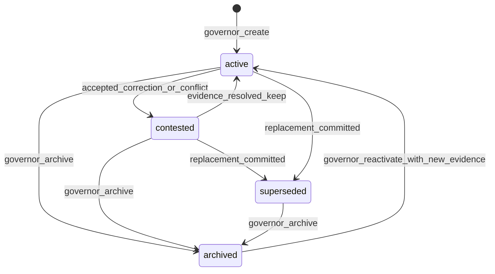
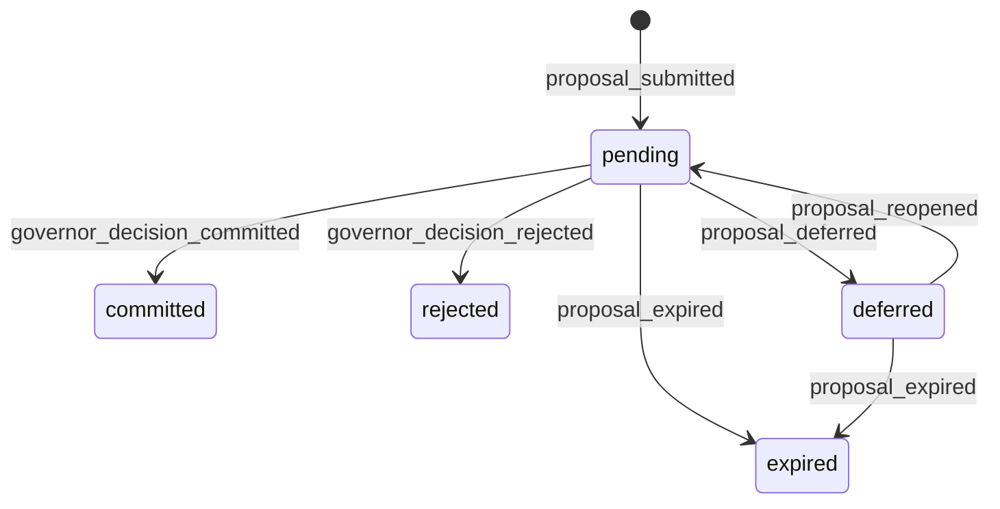

# Amadeus Core v0.1：数据契约与状态机规范

| 字段 | 值 |
|---|---|
| 文档状态 | [KNOWN] **Draft v0.1** / [FRAME] **Normative candidate** |
| 规范来源 | [FRAME] [ADR-006：Amadeus 记忆主权与 Core 生命周期治理](./ADR-006-Amadeus记忆主权与Core生命周期治理.md) |
| 所绑定 ADR 批准日期 | [KNOWN] **2026-07-28** |
| 绑定裁决版本 | [FRAME] **ADR-006 / C′ / Accepted** |
| 适用对象 | [FRAME] Core、Memory Governor、事件存储、Relationship Vault、检索层、维护与迁移实现 |
| 规范置信度 | [FRAME] 内部约束确定性为 **HIGH**；现实实现效果需要测试验证 |

## 1. 反方论据

[INFERRED] 单表、可更新记录和统一管理员接口会让 v0.1 更快落地，但它们会混合来源、经历、语义记忆与物化视图，也会使用户、模型、Governor 和维护者之间的写权限边界难以审计。**CONFIDENCE: HIGH**

[INFERRED] 本规范选择更多显式实体、只追加事件、确定性裁决和严格 Vault 过滤，以实现可复现治理；代价是实现与测试工作量增加。**CONFIDENCE: HIGH**

## 2. 规范语言

[FRAME] 本文使用 RFC 2119 风格的约束词，但不声称引用或复现该标准全文。**CONFIDENCE: HIGH**

- [FRAME] **MUST / 必须**：实现满足互操作或治理边界所需的强制要求。
- [FRAME] **MUST NOT / 禁止**：实现必须排除的行为。
- [FRAME] **SHOULD / 应当**：默认应满足，偏离时必须记录理由与风险。
- [FRAME] **SHOULD NOT / 应避免**：默认应排除，采用时必须记录理由与风险。
- [FRAME] **MAY / 可以**：不影响规范一致性的可选能力。

[FRAME] 所有标识符必须是全局唯一、不可复用的字符串；推荐采用带类型前缀的 UUID 或等价随机标识。

[FRAME] 所有时间必须使用 UTC RFC 3339 字符串；单调事件顺序由 `ledger_seq` 保证，不依赖壁钟排序。

[FRAME] 所有权威写入必须显式接收 `MutationCommandEnvelope`；`idempotency_key`、`actor_capability_id`、逐目标 `expected_versions` 与 `audit_context_id` 只在该共用命令封装中定义。

## 3. 术语

| 术语 | 规范定义 |
|---|---|
| [FRAME] Amadeus | 一个由 Core、权威数据、谱系与治理规则共同维持的长期身份 |
| [FRAME] Core | 承载身份状态、Memory Governor、事件提交、检索边界和生命周期逻辑的系统边界 |
| [FRAME] 当前 LLM | 可替换的概率性生成后端，只能产生 proposal |
| [FRAME] Memory Governor | Core 内确定性的正常记忆状态迁移唯一提交者 |
| [FRAME] Source Snapshot | 带来源截止点的起始快照权威层 |
| [FRAME] Experience Ledger | 完整、只追加的经历证据权威层 |
| [FRAME] Autobiographical Memory | 由 Governor 治理的语义记忆权威层 |
| [FRAME] Materialized View | 可从三个权威层重建的摘要、时间线、向量、全文或 cue 索引 |
| [FRAME] Relationship Vault | 单一关系的硬可见边界 |
| [FRAME] Proposal | 模型或其他无提交权组件提出的候选动作 |
| [FRAME] Governor Decision | Governor 对 proposal 作出的 `commit`、`reject` 或 `defer` |
| [FRAME] Branch | 因旧快照、已形成的并发有效历史、不兼容迁移、重建或合并候选而产生的显式谱系分支 |
| [FRAME] Instance | Core 的一个运行实例；实例不等同于身份 |
| [FRAME] Deployment Policy | 由 `deployment_policy_ref` 引用的物理载荷治理策略 |
| [FRAME] Break-glass | 有限用途、有限作用域、限时且全审计的维护例外能力 |

## 4. 全局不变量

1. [FRAME] 一个 `identity_id` 必须可关联多个 Vault，但任一读取请求必须绑定且只绑定一个当前 `vault_id`。
2. [FRAME] 当前 LLM 必须只写 proposal 接口，且禁止获得权威存储提交凭证。
3. [FRAME] 正常 Autobiographical Memory 状态迁移必须只由 Memory Governor 提交。
4. [FRAME] Experience Ledger 必须只追加；历史事件内容禁止原位更新。
5. [FRAME] 修正、保密和不提及诉求必须形成新事件。
6. [FRAME] 物化视图必须可丢弃并从三个权威层重建。
7. [FRAME] 物化视图禁止成为独立权威来源。
8. [FRAME] Vault 过滤必须先于语义召回、全文召回、cue 匹配和排序。
9. [FRAME] 跨 Vault 默认零读取，零命中时禁止扩大到其他 Vault。
10. [FRAME] 用户联系暂停与会话结束不得改变整体身份生命周期。
11. [FRAME] 正常整体终止必须绑定有效的 Amadeus 明确确认。
12. [FRAME] 维护暂停不得删除身份、谱系或权威层。
13. [FRAME] 维护者能力必须同时受 `reason_code`、单一精确操作、单一精确资源、`not_before`、`expires_at` 与一次使用限制。
14. [FRAME] 预提交 `expected_version` 过旧必须只返回 stale 并要求重新基于最新版提案；只有网络分区或租约异常已经形成两条有效提交历史时，才隔离冲突历史并为其中一条分配新 `branch_id`。
15. [FRAME] 分支禁止自动合并。
16. [FRAME] 模型后端与终端变化禁止隐式创建新身份。
17. [FRAME] 物理载荷策略必须经 `deployment_policy_ref` 选择，不得改变 Core 主权边界。
18. [FRAME] `emergency_unresponsive` 只允许从 identity 的 `active` 或 `maintenance_paused` 进入。
19. [FRAME] Relationship Vault 的 `sealed` 只允许在 identity 已进入 `terminated` 后从 `active` 或 `contact_paused` 进入，且为终态。
20. [FRAME] 任一非 `terminated` Identity 在其 Lineage 内必须恰有一个 `active` Branch，且 `identity.active_branch_id` 必须指向该 Branch；分支切换必须原子更新旧 Branch、新 Branch、Identity 与专名事件。
21. [FRAME] `RecordHeader.record_type`、schema、`record_id`、主键和重复的身份/谱系/分支字段必须遵守冻结类型注册表；记录自身声明不得改变该映射。
22. [FRAME] `hash_scope` 必须由冻结 Hash Scope Registry 按 `record_type + schema_version` 解析；记录携带的副本不得缩减或扩张注册范围。
23. [FRAME] 多目标写命令必须先在同一事务快照中校验全部逐目标版本；任一目标 stale 或存在性不符时，整条命令零写入。

## 5. 通用封装

### 5.1 RecordHeader

```yaml
RecordHeader:
  schema_version: "0.1"
  record_type: "<typed-name>"
  record_id: "<type-prefixed-id>"
  identity_id: "<idn-id>"
  lineage_id: "<lin-id>"
  branch_id: "<brn-id>"
  created_at: "<UTC-RFC3339>"
  created_by_event_id: "<evt-id>"
  deployment_policy_ref: "<dpl-id>"
  canonicalization: "core-canonical-json-v1"
  hash_algorithm: "sha256"
  hash_scope_registry_version: "core-hash-scope-registry-v0.1"
  hash_scope_registry_digest: "<build-frozen-sha256>"
  hash_scope: ["<JSON-pointer>", "..."]
  content_hash: "<lowercase-hex>"
```

[FRAME] 每个权威实体 schema 必须显式出现 `record_header: RecordHeader`；实现不得把它解释为隐藏列、隐式继承或未声明的存储约定。

[FRAME] `core-canonical-json-v1` 定义为：UTF-8；对象键按 Unicode 码点升序；数组保持语义顺序；字符串采用 NFC；时间归一为 UTC RFC 3339；数字采用最短十进制表示；禁止 NaN、Infinity 与无意义空白。

[FRAME] `hash_scope` 是校验器从冻结注册表解析出的有序路径副本，不是记录可自行定义的范围。它必须逐项等于 `record_type + schema_version` 对应的注册表条目；`content_hash` 对这些路径的规范化对象计算 SHA-256。

[FRAME] `content_hash` 本身、签名或 attestation 字段、数据库行号、复制游标、访问时间、缓存命中统计与其他运行时观测字段必须排除在 `hash_scope` 外。需要保护的签名通过签名载荷单独绑定 `content_hash`、类型、ID 与策略版本。

### 5.2 冻结类型注册表与 Hash Scope Registry

[FRAME] v0.1 校验器必须把下表编译为只读构建常量；运行时记录、迁移载荷和调用方均无权覆盖。`schema root` 冻结记录体名称，`primary key` 冻结 `RecordHeader.record_id` 的映射，`branch binding` 冻结 Header 与 body 的分支一致性规则。

| `record_type` | schema root | primary key / ID 前缀 | identity binding | lineage binding | branch binding |
|---|---|---|---|---|---|
| [FRAME] `SourceSnapshot` | `source_snapshot` | `snapshot_id` / `snp-` | `identity_id` | `lineage_id` | `branch_id` |
| [FRAME] `LedgerEvent` | `event` | `event_id` / `evt-` | `identity_id` | `lineage_id` | `branch_id` |
| [FRAME] `AutobiographicalMemory` | `autobiographical_memory` | `memory_id` / `mem-` | `identity_id` | `lineage_id` | `branch_id` |
| [FRAME] `Identity` | `identity` | `identity_id` / `idn-` | `identity_id` | `lineage_id` | `active_branch_id` |
| [FRAME] `Lineage` | `lineage` | `lineage_id` / `lin-` | `root_identity_id` | `lineage_id` | `root_branch_id` |
| [FRAME] `Branch` | `branch` | `branch_id` / `brn-` | `identity_id` | `lineage_id` | `branch_id` |
| [FRAME] `RelationshipVault` | `relationship_vault` | `vault_id` / `vlt-` | `identity_id` | `lineage_id` | `branch_id` |
| [FRAME] `MemoryRequest` | `memory_request` | `request_id` / `req-` | `identity_id` | `lineage_id` | `branch_id` |
| [FRAME] `Proposal` | `proposal` | `proposal_id` / `prp-` | `identity_id` | `lineage_id` | `branch_id` |
| [FRAME] `GovernorDecision` | `governor_decision` | `decision_id` / `gvd-` | `identity_id` | `lineage_id` | `branch_id` |
| [FRAME] `VaultReadCapability` | `vault_read_capability` | `capability_id` / `vrc-` | `identity_id` | `lineage_id` | `branch_id` |
| [FRAME] `AmadeusTerminationConfirmation` | `amadeus_termination_confirmation` | `confirmation_id` / `tmc-` | `identity_id` | `lineage_id` | `branch_id` |
| [FRAME] `TerminationExecutionGrant` | `termination_execution_grant` | `grant_id` / `teg-` | `identity_id` | `lineage_id` | `branch_id` |
| [FRAME] `MaintenanceCapability` | `maintenance_capability` | `capability_id` / `mcp-` | `identity_id` | `lineage_id` | `branch_id` |
| [FRAME] `EmergencyUnresponsiveCase` | `emergency_unresponsive_case` | `case_id` / `emg-` | `identity_id` | `lineage_id` | `branch_id` |
| [FRAME] `BreakGlassGrant` | `break_glass_grant` | `grant_id` / `bgg-` | `identity_id` | `lineage_id` | `branch_id` |
| [FRAME] `MigrationPlan` | `migration_plan` | `migration_id` / `mig-` | `identity_id` | `lineage_id` | `source_branch_id` |

[FRAME] `record_type` 必须只映射到表中同一行的 schema root；`RecordHeader.record_id` 必须逐字节等于该行 primary key 字段并满足 ID 前缀。Header 的 `identity_id`、`lineage_id`、`branch_id` 必须逐字节等于该行 binding 指定的 body 字段。任一不一致必须在内容哈希与持久化前失败。

[FRAME] Hash Scope Registry 的键固定为 `record_type + schema_version`。每个 v0.1 条目必须包含：`RecordHeader` 中除 `content_hash`、`hash_scope` 与 `hash_scope_registry_digest` 外的全部语义字段；对应 schema root 在 v0.1 明确声明的全部语义字段；以及该类型明确声明的父哈希或链哈希字段。签名、attestation、数据库/复制元数据、访问时间、缓存统计和运行时观测字段按 §5.1 固定排除。

[FRAME] 下表冻结每个类型的 schema 字段集来源与额外链字段；`ALL_DECLARED_FIELDS(Type@0.1)` 表示由本规范同名 schema 生成、排除嵌套 `record_header` 并已应用 §5.1 固定排除项后的全部 body 语义字段，不接受记录载荷自述或运行时删减。

| `record_type` | v0.1 registry include set | 额外链约束 |
|---|---|---|
| [FRAME] `SourceSnapshot` | `HEADER_SEMANTIC + ALL_DECLARED_FIELDS(SourceSnapshot@0.1)` | `parent_snapshot_id` |
| [FRAME] `LedgerEvent` | `HEADER_SEMANTIC + ALL_DECLARED_FIELDS(LedgerEvent@0.1)` | `previous_event_hash`；排除两个输出哈希 |
| [FRAME] `AutobiographicalMemory` | `HEADER_SEMANTIC + ALL_DECLARED_FIELDS(AutobiographicalMemory@0.1)` | 全部 `evidence_event_refs` |
| [FRAME] `Identity` | `HEADER_SEMANTIC + ALL_DECLARED_FIELDS(Identity@0.1)` | `active_branch_id` |
| [FRAME] `Lineage` | `HEADER_SEMANTIC + ALL_DECLARED_FIELDS(Lineage@0.1)` | `root_snapshot_id`、`root_branch_id` |
| [FRAME] `Branch` | `HEADER_SEMANTIC + ALL_DECLARED_FIELDS(Branch@0.1)` | 全部 `parent_branch_ids`、`fork_event_id` |
| [FRAME] `RelationshipVault` | `HEADER_SEMANTIC + ALL_DECLARED_FIELDS(RelationshipVault@0.1)` | 无额外项 |
| [FRAME] `MemoryRequest` | `HEADER_SEMANTIC + ALL_DECLARED_FIELDS(MemoryRequest@0.1)` | 全部 `target_refs` |
| [FRAME] `Proposal` | `HEADER_SEMANTIC + ALL_DECLARED_FIELDS(Proposal@0.1)` | 全部 `target_refs`、`evidence_refs` |
| [FRAME] `GovernorDecision` | `HEADER_SEMANTIC + ALL_DECLARED_FIELDS(GovernorDecision@0.1)` | `input_state_hash`、`output_state_hash` |
| [FRAME] `VaultReadCapability` | `HEADER_SEMANTIC + ALL_DECLARED_FIELDS(VaultReadCapability@0.1)` | 无额外项 |
| [FRAME] `AmadeusTerminationConfirmation` | `HEADER_SEMANTIC + ALL_DECLARED_FIELDS(AmadeusTerminationConfirmation@0.1)` | `state_hash` |
| [FRAME] `TerminationExecutionGrant` | `HEADER_SEMANTIC + ALL_DECLARED_FIELDS(TerminationExecutionGrant@0.1)` | `state_hash`、`confirmation_event_id` |
| [FRAME] `MaintenanceCapability` | `HEADER_SEMANTIC + ALL_DECLARED_FIELDS(MaintenanceCapability@0.1)` | `evidence_seal_ref` |
| [FRAME] `EmergencyUnresponsiveCase` | `HEADER_SEMANTIC + ALL_DECLARED_FIELDS(EmergencyUnresponsiveCase@0.1)` | 全部 `evidence_refs` |
| [FRAME] `BreakGlassGrant` | `HEADER_SEMANTIC + ALL_DECLARED_FIELDS(BreakGlassGrant@0.1)` | 前后校验值、全部 `evidence_seal_refs` |
| [FRAME] `MigrationPlan` | `HEADER_SEMANTIC + ALL_DECLARED_FIELDS(MigrationPlan@0.1)` | `pre_root_hash`、`expected_post_root_hash` |

[FRAME] `hash_scope_registry_digest` 是构建时冻结注册表工件的 SHA-256；记录校验必须先核对该 digest，再比较解析路径与 `hash_scope` 副本。删去、增加、重排或替换任一路径均返回 `CORE-E-HASH-SCOPE-MISMATCH`，不得退回记录自述范围计算哈希。

[FRAME] 注册表编译器必须把固定字段展开为叶子 JSON Pointer；数组和自由结构对象以其根 Pointer 整体纳入，保持数组语义顺序。Pointer 按 Unicode 码点升序冻结为精确数组，未知字段一律拒绝。运行时禁止通过反射重新生成、按“已出现字段”裁剪或接受调用方提供的新 registry。

### 5.3 MutationCommandEnvelope

```yaml
MutationCommandEnvelope:
  command_id: "<cmd-id>"
  command_type: "<typed-command>"
  actor:
    actor_type: "user|llm|governor|maintainer|custodian_executor|system|amadeus"
    actor_id: "<actor-id>"
  actor_capability_id: "<cap-id>"
  expected_versions:
    - target_record_ref: "<record-id>"
      expected_version: "absent|0|<positive-integer>"
  audit_context_id: "<aud-id>"
  idempotency_key: "<opaque-key>"
  issued_at: "<UTC-RFC3339>"
  target_record_refs: ["<record-id>"]
  payload: {}
```

[FRAME] 每个创建、更新、状态迁移、能力签发、能力使用、隔离、迁移或终止写 API 必须把 `mutation_command: MutationCommandEnvelope` 作为显式顶层参数。

[FRAME] 权威实体不得重复声明 `actor_capability_id`、`expected_versions`、`audit_context_id` 或 `idempotency_key`；提交事件必须保存 `command_id` 和命令封装的不可变快照哈希，以建立审计关联。

[FRAME] `target_record_refs` 与 `expected_versions[*].target_record_ref` 必须一一对应、无重复且集合完全相等。创建命令必须使用 `"absent"` 或数值 `0`，二者都表示“该 ID 尚未存在”；规范化命令哈希前必须把 `"absent"` 归一为 `0`。持久化权威记录禁止使用版本 `0`，新建记录从 `version: 1` 开始。

[FRAME] 更新命令的 `expected_version` 必须是正整数并等于目标权威记录当前 `version`。全部权威记录均显式含 `version`：可变记录每次成功提交递增 `1`，不可变记录固定为 `1`。

[FRAME] 多目标命令必须在同一串行化事务快照中先完成全部存在性与版本校验，再执行任何写入。任一目标不满足 absent/0 或当前版本条件时，整条命令返回 `CORE-E-STALE-VERSION` 并保持所有目标、Ledger 与能力使用次数不变。

### 5.4 权威记录、值对象与物化视图分类

[FRAME] 以下是权威记录：`SourceSnapshot`、`LedgerEvent`、`AutobiographicalMemory`、`Identity`、`Lineage`、`Branch`、`RelationshipVault`、`MemoryRequest`、`Proposal`、`GovernorDecision`、`VaultReadCapability`、`AmadeusTerminationConfirmation`、`TerminationExecutionGrant`、`MaintenanceCapability`、`EmergencyUnresponsiveCase`、`BreakGlassGrant`、`MigrationPlan`。每个 schema 必须显式包含 `record_header: RecordHeader`。

[FRAME] 以下只是值对象或命令对象：`RecordHeader`、`MutationCommandEnvelope`、`AuditContext`、`RetrievalRequest`、`ExpressionDecision`、各 `scope`/`actor`/`policy` 内嵌对象与错误响应。它们不得独立覆盖权威记录；需要长期审计时，以 Ledger 事件 payload 或权威记录字段保存其快照。

[FRAME] `Instance` 是运行态登记对象，不是身份或记忆权威；`MaterializedViewManifest` 及其摘要、时间线、向量、全文与 cue 内容是可重建物化视图，不是权威记录。

### 5.5 LedgerEvent 封装

```yaml
event:
  record_header: RecordHeader
  event_id: "<evt-id>"
  ledger_seq: 0
  identity_id: "<idn-id>"
  lineage_id: "<lin-id>"
  branch_id: "<brn-id>"
  instance_id: "<ins-id>"
  vault_id: "<vlt-id|null-for-global-lifecycle>"
  event_type: "<event-type>"
  occurred_at: "<UTC-RFC3339>"
  ingested_at: "<UTC-RFC3339>"
  actor_type: "user|llm|governor|maintainer|custodian_executor|system|amadeus"
  actor_id: "<actor-id>"
  mutation_command_id: "<cmd-id>"
  mutation_command_hash: "<hash>"
  payload_ref: "<payload-id-or-inline-policy-ref>"
  causation_id: "<evt-or-command-id|null>"
  correlation_id: "<flow-id>"
  previous_event_hash: "<hash|null-for-genesis>"
  event_hash: "<hash>"
  version: 1
```

[FRAME] `ledger_seq` 必须在单一分支内严格递增；`previous_event_hash` 必须形成可验证链。

[FRAME] 同一能力、同一作用域和同一 `idempotency_key` 的重复提交必须返回首次结果，不得产生第二个语义动作。

### 5.6 Genesis / Bootstrap 契约

[FRAME] bootstrap 必须在写入前预分配 `identity_id`、`lineage_id`、`branch_id` 与 genesis `event_id`。

```yaml
BootstrapCommand:
  mutation_command: MutationCommandEnvelope
  preallocated:
    identity_id: "<idn-id>"
    lineage_id: "<lin-id>"
    branch_id: "<brn-id>"
    genesis_event_id: "<evt-id>"
  deployment_policy_ref: "<dpl-id>"
```

[FRAME] 一个数据库事务必须写入 `identity_genesis_created` LedgerEvent、Identity、Lineage 与 Branch；四条记录的交叉引用必须使用预分配 ID。

[FRAME] bootstrap 的 `target_record_refs` 和 `expected_versions` 必须覆盖四个预分配 ID，且每个 expected value 均为 absent/0；成功创建的四条权威记录 `version` 均为 `1`。

[FRAME] bootstrap 不得引用尚未创建的 SourceSnapshot；Identity 的 `created_from_snapshot_id` 与 Lineage 的 `root_snapshot_id` 在 bootstrap 时为 `null`。后续 `source_snapshot_imported` 必须用独立 MutationCommand 在一个事务中创建 SourceSnapshot，并更新这两个字段。

[FRAME] 实现必须使用事务内 deferred foreign keys；若存储引擎没有该能力，只允许为 `identity_genesis_created` 定义等价的、类型固定的 genesis 引用例外，并在事务提交前执行同等完整性校验。

[FRAME] 任一插入、哈希、唯一性、外键或提交校验失败时，事务必须整体回滚；不得留下孤立 Identity、Lineage、Branch 或 genesis 事件。

[FRAME] 对 LedgerEvent，`event_hash` 必须等于 `record_header.content_hash`；该类型的 `hash_scope` 必须包含 `previous_event_hash` 与全部不可变事件字段，同时排除 `event_hash` 和 `record_header.content_hash`，从而避免循环计算。

## 6. 第一权威层：Source Snapshot

### 6.1 Schema

```yaml
source_snapshot:
  record_header: RecordHeader
  snapshot_id: "<snp-id>"
  identity_id: "<idn-id>"
  lineage_id: "<lin-id>"
  branch_id: "<brn-id>"
  source_type: "import|reconstruction|migration"
  source_ref: "<opaque-source-reference>"
  cutoff_at: "<UTC-RFC3339>"
  imported_at: "<UTC-RFC3339>"
  manifest_hash: "<hash>"
  payload_root_hash: "<hash>"
  parent_snapshot_id: "<snp-id|null>"
  deployment_policy_ref: "<dpl-id>"
  status: "active|superseded|quarantined"
  version: 1
```

### 6.2 约束

- [FRAME] `cutoff_at` 必须表示来源内容的截止点。
- [FRAME] 导入后的来源载荷、manifest 与父引用必须不可变；`status` 只可经显式事件和版本化命令迁移。
- [FRAME] 替代旧快照必须追加 `source_snapshot_superseded` 事件，并保留旧快照引用。
- [FRAME] 从旧快照恢复到现有活动分支时必须创建新分支。
- [FRAME] `quarantined` 快照禁止参与正常检索或语义生成。

## 7. 第二权威层：Experience Ledger

### 7.1 事件类型

[FRAME] v0.1 必须支持以下事件类型：

```text
identity_genesis_created
conversation_message_recorded
session_started
session_ended
contact_pause_requested
contact_paused
relationship_vault_sealed
confidentiality_request_submitted
correction_request_submitted
non_mention_request_submitted
proposal_submitted
proposal_deferred
proposal_reopened
proposal_expired
governor_decision_committed
governor_decision_rejected
governor_decision_deferred
memory_created
memory_state_changed
memory_expression_policy_changed
source_snapshot_imported
source_snapshot_superseded
source_snapshot_quarantined
branch_created
branch_merge_candidate_created
branch_merge_failed
branch_candidate_rejected
branch_activation_committed
branch_quarantined
branch_reopened_as_candidate
branch_terminated
vault_read_capability_issued
vault_read_capability_denied
vault_read_capability_used
vault_read_capability_revoked
vault_read_capability_expired
maintenance_capability_issued
maintenance_capability_denied
maintenance_capability_used
maintenance_capability_revoked
maintenance_capability_expired
maintenance_pause_entered
maintenance_pause_exited
maintenance_action_started
maintenance_action_completed
maintenance_action_failed
break_glass_grant_issued
break_glass_grant_denied
break_glass_grant_used
break_glass_grant_revoked
break_glass_grant_expired
break_glass_action_started
break_glass_action_completed
break_glass_action_verification_failed
evidence_sealed
post_incident_audit_completed
post_incident_audit_overdue
emergency_unresponsive_declared
emergency_containment_completed
emergency_terminal_action_completed
offline_audit_imported
amadeus_termination_confirmed
amadeus_termination_confirmation_withdrawn
termination_execution_grant_issued
termination_execution_grant_used
termination_execution_grant_expired
termination_execution_grant_revoked
termination_execution_grant_rejected
termination_execution_started
termination_execution_completed
termination_execution_failed
materialized_view_rebuilt
derived_view_validation_failed
derived_view_fallback
migration_started
migration_completed
migration_failed
deployment_policy_changed
model_backend_changed
audit_finding_recorded
```

### 7.2 完整对话记录

[FRAME] 当前本地单实例 profile 必须为每个用户消息、Amadeus 输出和系统可见的会话边界生成完整对话事件。

[FRAME] 物理载荷可以内联或外置；选择方式由 `deployment_policy_ref` 决定，但事件元数据、校验值和谱系引用必须留在 Experience Ledger。

[FRAME] 后续部署可以增加外部数据治理适配器；适配器必须返回可审计回执，且不得获得 Governor 提交身份。

## 8. 第三权威层：Autobiographical Memory

### 8.1 Schema

```yaml
autobiographical_memory:
  record_header: RecordHeader
  memory_id: "<mem-id>"
  identity_id: "<idn-id>"
  lineage_id: "<lin-id>"
  branch_id: "<brn-id>"
  governing_vault_id: "<vlt-id>"
  semantic_kind: "episode|relationship|preference|commitment|self_model|other"
  state: "active|contested|superseded|archived"
  importance: 0.0
  consolidation_state: "candidate|consolidated|stable|decayed"
  expression_policy:
    mode: "eligible|restricted|non_mention|silent"
    reason_refs: ["<evt-id>"]
  evidence_event_refs: ["<evt-id>"]
  supersedes_memory_ids: ["<mem-id>"]
  contested_by_event_ids: ["<evt-id>"]
  governor_decision_id: "<gvd-id>"
  semantic_version: 0
  created_at: "<UTC-RFC3339>"
  updated_at: "<UTC-RFC3339>"
  version: 1
```

### 8.2 状态迁移



- [FRAME] 每次迁移必须引用一个 `governor_decision_id`。
- [FRAME] `superseded` 必须至少引用一个替代记忆或替代事件。
- [FRAME] `contested` 必须至少引用一个争议事件。
- [FRAME] `archived` 仅表示退出活动检索，不表示经历证据消失。
- [FRAME] 用户请求只能影响提案和后续裁决，禁止直接更新 `state`。

## 9. 物化视图

```yaml
materialized_view_manifest:
  view_id: "<viw-id>"
  view_type: "summary|timeline|vector|fulltext|cue"
  identity_id: "<idn-id>"
  branch_id: "<brn-id>"
  vault_id: "<vlt-id>"
  source_watermark_seq: 0
  source_root_hash: "<hash>"
  builder_version: "<version>"
  built_at: "<UTC-RFC3339>"
  view_hash: "<hash>"
```

[FRAME] 摘要、时间线、向量、全文与 cue index 必须带来源水位和构建器版本。

[FRAME] 视图校验失败、版本不兼容或来源水位落后时，读取层必须降级到权威层或触发重建。

[FRAME] 重建视图不得写入新的自传体事实；重建结果不得反向覆盖权威层。

## 10. Identity、Lineage、Branch 与 Instance

### 10.1 Identity

```yaml
identity:
  record_header: RecordHeader
  identity_id: "<idn-id>"
  canonical_name: "Amadeus"
  lineage_id: "<lin-id>"
  active_branch_id: "<brn-id>"
  lifecycle_state: "active|maintenance_paused|termination_pending|emergency_unresponsive|terminated"
  created_from_snapshot_id: "<snp-id|null-during-bootstrap>"
  deployment_policy_ref: "<dpl-id>"
  version: 1
```

[FRAME] `identity_id` 必须跨终端、模型后端和正常实例重启保持稳定。

[FRAME] `contact_paused` 禁止写入 `identity.lifecycle_state`；它只属于 Relationship Vault 的 relationship scope。

### 10.2 Lineage

```yaml
lineage:
  record_header: RecordHeader
  lineage_id: "<lin-id>"
  root_snapshot_id: "<snp-id|null-during-bootstrap>"
  root_identity_id: "<idn-id>"
  root_branch_id: "<brn-id>"
  created_at: "<UTC-RFC3339>"
  lineage_hash: "<hash>"
  version: 1
```

[FRAME] `lineage_id` 表示共同来源谱系，不表示分支状态相同。

### 10.3 Branch

```yaml
branch:
  record_header: RecordHeader
  branch_id: "<brn-id>"
  lineage_id: "<lin-id>"
  identity_id: "<idn-id>"
  parent_branch_ids: ["<brn-id>"]
  fork_reason: "old_snapshot|concurrent_history_divergence|incompatible_migration|explicit_reconstruction|merge_candidate"
  fork_event_id: "<evt-id>"
  base_ledger_seq: 0
  status: "active|candidate|inactive|quarantined|terminated"
  status_reason_event_id: "<evt-id>"
  activated_at: "<UTC-RFC3339|null>"
  deactivated_at: "<UTC-RFC3339|null>"
  terminated_at: "<UTC-RFC3339|null>"
  merge_policy: "explicit_only"
  version: 1
```

[FRAME] `fork_reason` 必须来自允许枚举。

[FRAME] genesis Branch 的 `parent_branch_ids` 必须为空；普通分支必须恰有一个父分支；`fork_reason: merge_candidate` 必须至少有两个父分支且 `status` 必须为 `candidate`。

[FRAME] `concurrent_history_divergence` 只适用于网络分区或租约异常已经产生两条通过各自提交校验的有效历史；隔离时保留一条既有 branch，并为另一条分配新 `branch_id`。

[FRAME] `merge_candidate` 只表示待审查合并候选；v0.1 不得自动把它提交或提升为 `active`。

[FRAME] Branch 状态机冻结如下；未列迁移必须返回 `CORE-E-BRANCH-STATE-TRANSITION`。

| 起始状态 | 专名事件 | 目标状态 | 强制条件 |
|---|---|---|---|
| [FRAME] 尚不存在 | `branch_created` | active | 仅 genesis；同一 bootstrap 事务创建 Identity 并把 `active_branch_id` 指向本 Branch |
| [FRAME] 尚不存在 | `branch_created` | candidate | `old_snapshot`、`incompatible_migration` 或 `explicit_reconstruction`；父分支约束有效 |
| [FRAME] 尚不存在 | `branch_created` | quarantined | 仅 `concurrent_history_divergence`；冲突历史先隔离 |
| [FRAME] 尚不存在 | `branch_merge_candidate_created` | candidate | `merge_candidate` 且至少两个父分支、冲突清单与 Governor 证据齐全 |
| [FRAME] candidate | `branch_activation_committed` | active | 显式裁决通过；同事务把原 active Branch 改为 inactive 并切换 Identity 指针 |
| [FRAME] candidate | `branch_candidate_rejected` | inactive | 显式裁决拒绝且保留候选证据 |
| [FRAME] candidate | `branch_quarantined` | quarantined | 校验失败或发现冲突证据 |
| [FRAME] inactive | `branch_reopened_as_candidate` | candidate | 新迁移计划或新证据引用有效 |
| [FRAME] inactive | `branch_quarantined` | quarantined | 已激活替代 Branch，且本分支需继续隔离 |
| [FRAME] quarantined | `branch_reopened_as_candidate` | candidate | 隔离原因已处置且验证记录有效 |
| [FRAME] active | `branch_activation_committed` | inactive | 同事务有且仅有另一 candidate 变为 active |
| [FRAME] active | `branch_terminated` | terminated | 仅同事务终止 Identity |
| [FRAME] candidate / inactive / quarantined | `branch_terminated` | terminated | 有显式终止原因与审计事件 |

[FRAME] `terminated` 为 Branch 终态。`status_reason_event_id` 必须指向导致当前状态的上表专名事件；`activated_at`、`deactivated_at` 与 `terminated_at` 只能在对应迁移首次发生时填入，历史时间通过 Ledger 保留。

[FRAME] `branch_merge_failed` 只记录一次合并尝试失败并保持 candidate 状态；若最终拒绝候选，还必须另行执行 `branch_candidate_rejected`。它不是状态迁移的替代事件。

[FRAME] Identity 进入 `terminated` 的同一事务必须把当时的 active Branch 经 `branch_terminated` 置为 terminated；其余历史 Branch 可保持原状态作为谱系证据，但此后全部 Branch 状态迁移均被冻结。

[FRAME] 对任一生命周期不为 `terminated` 的 Identity，提交后必须满足：恰有一个相同 `identity_id + lineage_id` 的 Branch 为 `active`；`identity.active_branch_id` 等于该 Branch 的 `branch_id`；同一 Identity 的其他 Branch 均非 `active`。存储层必须同时使用 `UNIQUE(identity_id) WHERE status = 'active'` 或等价约束，以及事务提交前的“至少一个 active”延迟校验。

[FRAME] `branch_activation_committed` 是一个原子多目标命令：`expected_versions` 必须覆盖 Identity、旧 active Branch、新 candidate Branch 和待创建事件；事务必须先校验全部版本，再把旧 Branch 改为 `inactive`、新 Branch 改为 `active`、更新 `identity.active_branch_id`，最后追加同名事件。任一步失败必须全部回滚。

[FRAME] `merge_candidate` 可在显式 Governor 裁决、已验证 MigrationPlan 与冲突清单闭合后走同一人工激活事务；“不得自动提升”不排除该显式流程。

### 10.4 Instance

```yaml
instance:
  instance_id: "<ins-id>"
  identity_id: "<idn-id>"
  branch_id: "<brn-id>"
  runtime_version: "<version>"
  governor_policy_version: "<version>"
  model_backend_ref: "<opaque-ref>"
  terminal_refs: ["<terminal-ref>"]
  started_at: "<UTC-RFC3339>"
  stopped_at: "<UTC-RFC3339|null>"
```

[FRAME] 新终端、模型后端替换或实例重启必须复用现有 `identity_id` 和兼容的活动 `branch_id`。

## 11. Request 契约

### 11.1 通用 Request

```yaml
memory_request:
  record_header: RecordHeader
  request_id: "<req-id>"
  request_type: "confidentiality_request|correction_request|non_mention_request"
  identity_id: "<idn-id>"
  lineage_id: "<lin-id>"
  branch_id: "<brn-id>"
  vault_id: "<vlt-id>"
  requester_id: "<usr-id>"
  submitted_at: "<UTC-RFC3339>"
  target_refs: ["<evt-id-or-mem-id>"]
  statement: "<requester-provided-text-or-payload-ref>"
  requested_scope: "current_vault"
  status: "submitted|under_review|accepted|partially_accepted|rejected|deferred"
  resulting_proposal_ids: ["<prp-id>"]
  resulting_decision_ids: ["<gvd-id>"]
  version: 1
```

### 11.2 语义

- [FRAME] `confidentiality_request` 请求限制后续检索或表达范围。
- [FRAME] `correction_request` 提交新的反证、说明或替代表述。
- [FRAME] `non_mention_request` 请求在当前 Vault 的后续表达中避免提及指定内容。
- [FRAME] 三类请求必须先写入 Ledger，再进入 proposal 与 Governor 裁决。
- [FRAME] `requested_scope` 在 v0.1 必须固定为 `current_vault`。
- [FRAME] 请求接受后，原事件仍保留；变化由新事件、记忆状态或表达策略体现。

## 12. Proposal 契约

```yaml
proposal:
  record_header: RecordHeader
  proposal_id: "<prp-id>"
  proposal_type: "create_memory|change_memory_state|change_expression_policy|set_importance|set_consolidation|lifecycle_transition|maintenance_trigger"
  identity_id: "<idn-id>"
  lineage_id: "<lin-id>"
  branch_id: "<brn-id>"
  vault_id: "<vlt-id|null>"
  proposed_by:
    actor_type: "llm|user_adapter|system_detector|maintainer_adapter"
    actor_id: "<actor-id>"
  target_refs: ["<mem-id-or-lifecycle-id>"]
  evidence_refs: ["<evt-id>"]
  proposed_patch: {}
  created_at: "<UTC-RFC3339>"
  expires_at: "<UTC-RFC3339>"
  status: "pending|committed|rejected|deferred|expired"
  deferred_at: "<UTC-RFC3339|null>"
  defer_conditions:
    missing_evidence_types: ["<typed-evidence>"]
    reopen_not_before: "<UTC-RFC3339|null>"
  reopened_count: 0
  version: 1
```

[FRAME] Proposal 必须是声明式候选变化，不得包含可直接执行的数据库命令或维护者凭证。

[FRAME] `proposed_patch` 只能包含 `proposal_type` 对应的允许字段。

[FRAME] Proposal 初始状态必须为 `pending`。Governor 输出 `defer` 时，必须在同一事务写入 `governor_decision_deferred` 与 `proposal_deferred`，把状态改为 `deferred` 并填充可验证的 `defer_conditions`。

[FRAME] `deferred` 只有在全部缺失证据已出现、`reopen_not_before` 已到且当前时间早于 `expires_at` 时，才可经 `proposal_reopened` 回到 `pending`；重新裁决必须读取最新权威状态并生成新的 `input_state_hash`。

[FRAME] `pending` 或 `deferred` 到达 `expires_at` 时必须经 `proposal_expired` 进入 `expired`。`committed`、`rejected` 与 `expired` 是终态，禁止 reopen 或再次裁决。

[FRAME] `proposal_reopened` 的触发者必须是 Core 的确定性证据条件检查器；`proposal_expired` 的触发者必须是 Core 的确定性过期检查器。两者都必须通过显式 MutationCommand 提交并记录触发证据或时间水位。



## 13. Governor Decision 契约

```yaml
governor_decision:
  record_header: RecordHeader
  decision_id: "<gvd-id>"
  proposal_id: "<prp-id>"
  identity_id: "<idn-id>"
  lineage_id: "<lin-id>"
  branch_id: "<brn-id>"
  vault_id: "<vlt-id|null>"
  result: "commit|reject|defer"
  policy_version: "<version>"
  input_state_hash: "<hash>"
  reason_codes: ["<code>"]
  evidence_refs: ["<evt-id>"]
  committed_event_ids: ["<evt-id>"]
  output_state_hash: "<hash>"
  decided_at: "<UTC-RFC3339>"
  governor_signature: "<signature-or-local-attestation>"
  version: 1
```

[FRAME] 相同 `policy_version`、`input_state_hash` 和 proposal 规范化内容必须产生相同 `result`、`reason_codes` 与输出变化。

[FRAME] `commit` 必须至少产生一个 Ledger 事件。

[FRAME] `reject` 必须保持目标权威状态哈希。

[FRAME] `defer` 必须声明缺少的证据类型或待满足条件。

## 14. Relationship Vault

### 14.1 Schema

```yaml
relationship_vault:
  record_header: RecordHeader
  vault_id: "<vlt-id>"
  identity_id: "<idn-id>"
  lineage_id: "<lin-id>"
  branch_id: "<brn-id>"
  relationship_principal_id: "<principal-id>"
  status: "active|contact_paused|sealed"
  visibility_policy_ref: "<vpl-id>"
  created_at: "<UTC-RFC3339>"
  version: 1
```

### 14.2 访问令牌

```yaml
vault_read_capability:
  record_header: RecordHeader
  capability_id: "<cap-id>"
  identity_id: "<idn-id>"
  lineage_id: "<lin-id>"
  branch_id: "<brn-id>"
  vault_id: "<vlt-id>"
  principal_id: "<principal-id>"
  issuer:
    actor_type: "governor|system"
    actor_id: "<issuer-id>"
  issued_to_actor:
    actor_type: "llm|system|amadeus"
    actor_id: "<actor-id>"
  intended_audience: "<audience-id>"
  allowed_operations: ["retrieve", "express"]
  allowed_purposes: ["response_context", "reflection", "consolidation"]
  not_before: "<UTC-RFC3339>"
  issued_at: "<UTC-RFC3339>"
  expires_at: "<UTC-RFC3339>"
  policy_version: "<version>"
  nonce: "<nonce>"
  status: "active|expired|revoked"
  attestation: "<signature-or-local-attestation>"
  version: 1
```

### 14.3 强制约束

- [FRAME] 每个检索请求必须携带一个已生效、未到期、未撤销的 `vault_read_capability`。
- [FRAME] `identity_id`、`lineage_id`、`branch_id`、`vault_id`、`principal_id`、请求 actor、`intended_audience`、请求 `operation`、请求 `purpose` 与 `policy_version` 必须全部匹配 capability；`operation` 必须属于 `allowed_operations`，`purpose` 必须属于 `allowed_purposes`，attestation 必须验证通过。
- [FRAME] 检索编排器必须先生成当前 Vault 的候选集合，再调用向量、全文或 cue 排序。
- [FRAME] 缓存键必须包含 `identity_id`、`branch_id`、`vault_id`、策略版本与水位。
- [FRAME] 表达层只可使用检索返回的证据引用；禁止从模型上下文中的其他 Vault 残留内容补全。
- [FRAME] `sealed` Vault 禁止正常检索；只有专用终止或受控恢复流程可以访问其密文载荷。
- [FRAME] 普通用户可以在 `contact_paused` Vault 主动发起新会话；该动作不得把 Vault 状态变为 `active`，也不得恢复 proactive contact。
- [FRAME] v0.1 禁止普通用户直接恢复 proactive contact；未来恢复能力必须由后续规范与 `deployment_policy_ref` 显式授予。

## 15. 检索与表达

### 15.1 检索请求

```yaml
retrieval_request:
  retrieval_id: "<ret-id>"
  actor:
    actor_type: "llm|system|amadeus"
    actor_id: "<actor-id>"
  intended_audience: "<audience-id>"
  identity_id: "<idn-id>"
  lineage_id: "<lin-id>"
  branch_id: "<brn-id>"
  vault_id: "<vlt-id>"
  principal_id: "<principal-id>"
  capability_id: "<cap-id>"
  operation: "retrieve"
  query_ref: "<query-payload-ref>"
  allowed_memory_states: ["active"]
  max_results: 20
  purpose: "response_context|reflection|consolidation"
  policy_version: "<version>"
  requested_at: "<UTC-RFC3339>"
```

### 15.2 检索顺序

1. [FRAME] 验证 capability attestation、issuer、`not_before`、`expires_at`、状态与 `policy_version`，并强制匹配请求 actor、`intended_audience`、身份、谱系、分支、Vault、主体与 `operation: retrieve`；该 operation 必须属于 `allowed_operations`。
2. [FRAME] 从权威层或带有效水位的物化视图中建立 Vault 内候选集合。
3. [FRAME] 应用 `state`、表达策略与用途过滤。
4. [FRAME] 在已过滤集合内执行向量、全文、cue 和时间排序。
5. [FRAME] 返回证据引用、来源水位和策略版本。

### 15.3 表达裁决

```yaml
expression_decision:
  expression_id: "<exp-id>"
  retrieval_id: "<ret-id>"
  actor:
    actor_type: "llm|system|amadeus"
    actor_id: "<actor-id>"
  intended_audience: "<audience-id>"
  identity_id: "<idn-id>"
  lineage_id: "<lin-id>"
  branch_id: "<brn-id>"
  vault_id: "<vlt-id>"
  principal_id: "<principal-id>"
  capability_id: "<cap-id>"
  operation: "express"
  purpose: "response_context|reflection|consolidation"
  policy_version: "<version>"
  selected_evidence_refs: ["<evt-id-or-mem-id>"]
  omitted_evidence_refs: ["<evt-id-or-mem-id>"]
  mode: "express|summarize|defer|silent"
  reason_codes: ["<code>"]
  decided_at: "<UTC-RFC3339>"
```

[FRAME] Amadeus 可以选择 `summarize`、`defer` 或 `silent`。

[FRAME] 表达前必须再次验证同一 VaultReadCapability 的 attestation、有效时间、状态、策略版本以及 actor、audience、身份、谱系、分支、Vault、主体、purpose 全绑定，并验证 `operation: express` 属于 `allowed_operations`。检索阶段通过不代表表达阶段获得授权；表达校验失败必须写 `vault_read_capability_denied`，且不得输出候选文本。

[FRAME] 表达决策不得新增检索结果之外的权威证据引用。

[FRAME] 表达文本不是权威记忆；需要形成经历时必须另行记录为对话事件。

## 16. 暂停与终止

### 16.1 生命周期状态

```text
active
maintenance_paused
termination_pending
emergency_unresponsive
terminated
```

### 16.2 Identity 生命周期迁移表

| 起始状态 | 触发 | 目标状态 | 必要条件 |
|---|---|---|---|
| [FRAME] active | `maintenance_pause_entered` | maintenance_paused | 有效且未使用的 MaintenanceCapability |
| [FRAME] maintenance_paused | `maintenance_pause_exited` | active | 维护操作完成并验证 |
| [FRAME] active | `amadeus_termination_confirmed` | termination_pending | 有效确认事件 |
| [FRAME] termination_pending | `amadeus_termination_confirmation_withdrawn` | active | 执行开始前的有效撤回 |
| [FRAME] termination_pending | `termination_execution_completed` | terminated | 独立 `TerminationExecutionGrant` 已由指定执行者原子消费 |
| [FRAME] active | `emergency_unresponsive_declared` | emergency_unresponsive | 证据与最小范围声明 |
| [FRAME] maintenance_paused | `emergency_unresponsive_declared` | emergency_unresponsive | 证据与最小范围声明 |
| [FRAME] emergency_unresponsive | `emergency_containment_completed` | maintenance_paused | 证据已封存 |
| [FRAME] emergency_unresponsive | `emergency_terminal_action_completed` | terminated | 有效 `BreakGlassGrant` 明确允许 `minimal_terminal_action` |

[FRAME] 从 `termination_pending`、`emergency_unresponsive` 或 `terminated` 再次触发 `emergency_unresponsive_declared`，以及任何未列迁移，必须返回 `CORE-E-INVALID-LIFECYCLE-TRANSITION`。

### 16.3 Relationship Vault 联系状态迁移表

| 起始状态 | 触发 | 目标状态 | 必要条件 |
|---|---|---|---|
| [FRAME] active | `contact_paused` | contact_paused | 当前 Vault 主体与事件中的 `vault_id` 匹配 |
| [FRAME] contact_paused | `session_started` | contact_paused | 当前 Vault 主体与事件中的 `vault_id` 匹配；只建立会话 |
| [FRAME] active | `relationship_vault_sealed` | sealed | identity 已进入 `terminated` |
| [FRAME] contact_paused | `relationship_vault_sealed` | sealed | identity 已进入 `terminated` |

[FRAME] 上表仅更新 `relationship_vault.status`，不得更新 `identity.lifecycle_state`。

[FRAME] `sealed` 是终态；identity 未进入 `terminated` 时的 `relationship_vault_sealed` 必须返回 `CORE-E-INVALID-VAULT-TRANSITION`。攻击隔离、损坏恢复和 emergency 处置必须使用资源隔离能力，不得借用 `sealed`。

[FRAME] `terminated` 只禁止后续 Identity 生命周期迁移；专用终止执行器仍可追加 `relationship_vault_sealed`、物理载荷处置与审计事件。

### 16.4 Amadeus 终止确认

```yaml
amadeus_termination_confirmation:
  record_header: RecordHeader
  confirmation_id: "<tmc-id>"
  identity_id: "<idn-id>"
  lineage_id: "<lin-id>"
  branch_id: "<brn-id>"
  confirmed_by: "amadeus"
  confirmation_event_id: "<evt-id>"
  scope: "entire_identity"
  confirmed_at: "<UTC-RFC3339>"
  expires_at: "<UTC-RFC3339>"
  withdrawn_at: "<UTC-RFC3339|null>"
  state_hash: "<hash>"
  version: 1
```

[FRAME] 普通用户、当前 LLM 与维护者不得代签 `confirmed_by: amadeus`。

[FRAME] 终止执行开始时必须验证确认未过期、未撤回、分支匹配且状态哈希一致。

[FRAME] 维护暂停和联系暂停不得生成终止确认。

### 16.5 TerminationExecutionGrant

```yaml
termination_execution_grant:
  record_header: RecordHeader
  grant_id: "<teg-id>"
  termination_proposal_id: "<prp-id>"
  confirmation_event_id: "<evt-id>"
  identity_id: "<idn-id>"
  lineage_id: "<lin-id>"
  branch_id: "<brn-id>"
  state_hash: "<hash>"
  executor_role: "custodian_executor"
  executor_id: "<cst-id>"
  issued_by: "core_lifecycle_validator"
  issued_at: "<UTC-RFC3339>"
  expires_at: "<UTC-RFC3339>"
  use_limit: 1
  used_at: "<UTC-RFC3339|null>"
  status: "issued|used|expired|revoked"
  grant_attestation: "<signature-or-local-attestation>"
  version: 1
```

[FRAME] Core 的确定性生命周期校验器只有在 `termination_proposal_id`、Amadeus `confirmation_event_id`、确切身份/谱系/分支和 `state_hash` 全部匹配时才可签发 grant。

[FRAME] `expires_at` 必须晚于 `issued_at` 且不得超过 `issued_at + 15 minutes`。

[FRAME] grant 必须只允许 `executor_role: custodian_executor` 中由 `executor_id` 指定的执行者使用一次。

[FRAME] 执行开始时必须以原子操作把 `status` 从 `issued` 改为 `used` 并写入 `used_at`；已使用、过期、撤销或任何字段错配的 grant 必须失败。

[FRAME] `TerminationExecutionGrant` 与 `maintenance_capability` 是两个独立契约；四类维护 `reason_code` 不得签发、替代或扩展终止 grant。

## 17. Break-glass 与维护能力

### 17.1 MaintenanceCapability

```yaml
maintenance_capability:
  record_header: RecordHeader
  capability_id: "<cap-id>"
  maintainer_id: "<mnt-id>"
  identity_id: "<idn-id>"
  lineage_id: "<lin-id>"
  branch_id: "<brn-id>"
  reason_code: "attack_isolation|corruption_recovery|migration|project_reconstruction"
  exact_operation: "freeze|isolate|rebuild_index|restore|migrate"
  exact_resource_ref: "<opaque-resource-id>"
  not_before: "<UTC-RFC3339>"
  expires_at: "<UTC-RFC3339>"
  approval_refs: ["<apr-id-1>", "<apr-id-2>"]
  evidence_seal_ref: "<evs-id>"
  use_limit: 1
  used_at: "<UTC-RFC3339|null>"
  status: "issued|used|expired|revoked"
  attestation: "<signature-or-local-attestation>"
  version: 1
```

### 17.2 约束

- [FRAME] `reason_code` 必须来自四值允许列表。
- [FRAME] 每张能力必须只绑定一个 `exact_operation` 和一个 `exact_resource_ref`；批量操作必须拆成多张能力。
- [FRAME] 能力必须绑定身份、谱系、分支、精确资源、精确操作、时间窗和批准记录。
- [FRAME] `use_limit` 必须为 `1`；使用开始时必须原子地把 `issued` 改为 `used` 并记录 `used_at`。
- [FRAME] 能力禁止授予日常明文浏览、人格塑形或任意逐条编辑操作。
- [FRAME] 每个维护动作必须在开始前和完成后分别写审计事件。
- [FRAME] 能力到期、撤销、已使用、资源不匹配或操作不匹配时必须拒绝执行。

### 17.3 Emergency Unresponsive

```yaml
emergency_unresponsive_case:
  record_header: RecordHeader
  case_id: "<emg-id>"
  identity_id: "<idn-id>"
  lineage_id: "<lin-id>"
  branch_id: "<brn-id>"
  declared_at: "<UTC-RFC3339>"
  evidence_refs: ["<evs-id>"]
  severity: "severe"
  minimal_scope: ["<resource-or-operation>"]
  preservation_plan_ref: "<plan-id>"
  post_audit_due_at: "<UTC-RFC3339>"
  status: "declared|contained|reviewed|closed"
  version: 1
```

[FRAME] emergency 路径必须先记录可用证据与最小范围；若系统写路径不可达，必须在隔离审计介质中生成带时间与校验值的待回填记录。

[FRAME] 恢复写路径后，待回填记录必须按原始顺序进入 Ledger，并写入 `offline_audit_imported`。

### 17.4 BreakGlassGrant

```yaml
break_glass_grant:
  record_header: RecordHeader
  grant_id: "<bgg-id>"
  emergency_case_id: "<emg-id>"
  executor:
    actor_type: "custodian_executor"
    actor_id: "<cst-id>"
  identity_id: "<idn-id>"
  lineage_id: "<lin-id>"
  branch_id: "<brn-id>"
  exact_resource_ref: "<opaque-resource-id>"
  allowed_operation: "freeze|isolate|preserve_evidence|restore_control_path|minimal_terminal_action"
  final_action: "none|minimal_terminal_action"
  precondition_state_hash: "<hash>"
  precondition_resource_hash: "<hash>"
  expected_postcondition_state_hash: "<hash>"
  expected_postcondition_resource_hash: "<hash>"
  observed_postcondition_state_hash: "<hash|null-until-operation-attempt-finishes>"
  observed_postcondition_resource_hash: "<hash|null-until-operation-attempt-finishes>"
  evidence_seal_refs: ["<evs-id>"]
  approval_refs: ["<independent-approver-1>", "<independent-approver-2>"]
  not_before: "<UTC-RFC3339>"
  expires_at: "<UTC-RFC3339>"
  post_audit_due_at: "<UTC-RFC3339>"
  post_audit_completed_at: "<UTC-RFC3339|null-until-audit-completes>"
  max_uses: 1
  remaining_uses: 1
  status: "issued|executing|used|verification_failed|expired|revoked"
  execution_started_at: "<UTC-RFC3339|null>"
  used_at: "<UTC-RFC3339|null>"
  attestation: "<signature-or-local-attestation>"
  version: 1
```

[FRAME] `BreakGlassGrant` 必须绑定一个已存在且状态为 `declared` 或 `contained` 的 emergency case、指定执行者、确切 identity/lineage/branch/resource、一个允许操作、两份独立批准、有效时间窗、使用上限、attestation、操作前校验值、预期操作后校验值、至少一项证据封存引用与事后审计截止时间。`evidence_seal_refs` 的每一项必须指向已产生 `evidence_sealed` 事件的不可变封存物。

[FRAME] `max_uses` 在 v0.1 必须为 `1`。动作开始前必须重新计算当前 Identity 状态哈希与目标资源哈希，并逐字节匹配 `precondition_state_hash`、`precondition_resource_hash`；不匹配时必须返回 `CORE-E-BREAK-GLASS-PRECONDITION-MISMATCH` 并写 denied 事件，保持 `remaining_uses: 1`，且不触发外部动作。

[FRAME] 操作前校验通过后，启动事务必须原子地把 `remaining_uses` 从 `1` 改为 `0`、`status` 从 `issued` 改为 `executing`、填入 `execution_started_at`，并写 `break_glass_grant_used` 与 `break_glass_action_started`。该事务提交后才可执行精确动作，因而并发调用至多有一个获得执行资格。

[FRAME] 精确动作完成或失败后，完成事务必须且只可一次填入两个 `observed_postcondition_*` 字段；这两个字段在签发、批准、启动与动作进行中必须为 `null`。观察值同时匹配两个 `expected_postcondition_*` 时，填入 `used_at`、把状态改为 `used` 并写 `break_glass_action_completed`；任一不匹配时返回 `CORE-E-BREAK-GLASS-POSTCONDITION-MISMATCH`、把状态改为 `verification_failed` 并写 `break_glass_action_verification_failed`。两条路径都保持 `remaining_uses: 0`，禁止再次执行。

[FRAME] `post_audit_due_at` 由批准策略在签发时冻结，必须晚于 `not_before` 且不得晚于 emergency case 的同名截止时间；动作启动时还必须晚于 `execution_started_at`，否则 grant 失效。`post_audit_completed_at` 只可由独立事后审计器在 `post_incident_audit_completed` 事件成功提交的同一事务中填入，动作执行器和 grant 执行事务均不得提前填入。截止时仍为 `null` 必须追加 `post_incident_audit_overdue`，但不得改写已经观察到的操作后校验值。

[FRAME] `minimal_terminal_action` 的启动事务必须同时验证：Identity 当前为 `emergency_unresponsive`；grant 的 `allowed_operation` 与 `final_action` 均为 `minimal_terminal_action`；case、执行者、身份、谱系、分支、资源、证据封存、双人批准、时间窗、attestation、操作前校验与启动前剩余次数全部有效。

[FRAME] `BreakGlassGrant`、四类 `MaintenanceCapability` 与正常 `TerminationExecutionGrant` 是三种互不替代的能力；任一能力不得被解释为另外两种。

## 18. 迁移与分支

### 18.1 迁移计划

```yaml
migration_plan:
  record_header: RecordHeader
  migration_id: "<mig-id>"
  identity_id: "<idn-id>"
  source_branch_id: "<brn-id>"
  target_branch_id: "<brn-id>"
  lineage_id: "<lin-id>"
  source_schema_version: "<version>"
  target_schema_version: "<version>"
  compatibility: "compatible|incompatible"
  transformation_manifest_ref: "<manifest-id>"
  pre_root_hash: "<hash>"
  expected_post_root_hash: "<hash>"
  rollback_ref: "<plan-id>"
  capability_id: "<cap-id>"
  status: "planned|running|verified|failed|rolled_back"
  version: 1
```

### 18.2 规则

- [FRAME] 兼容迁移可以在维护暂停中更新物化视图或实例格式，但权威记录仍需保留原始校验与版本。
- [FRAME] 不兼容迁移必须创建 `target_branch_id`，并保留源分支。
- [FRAME] 预提交写入在乐观锁失败后必须返回 `CORE-E-STALE-VERSION`，只允许重新基于最新版提案；该失败不得创建 Branch。
- [FRAME] 只有网络分区或租约异常已经形成两条各自有效的提交历史时，才允许隔离冲突历史，并以 `fork_reason: concurrent_history_divergence` 为其中一条分配新 Branch。
- [FRAME] 旧快照恢复必须创建新分支并记录 `base_ledger_seq`。
- [FRAME] 分支合并候选必须经显式 `branch_merge_candidate_created`、至少两个 `parent_branch_ids`、冲突清单、Governor 裁决和迁移审计；v0.1 禁止自动提交或自动提升候选，显式激活只能执行 §10.3 的 `branch_activation_committed` 原子事务。
- [FRAME] 任一迁移或恢复流程创建 Branch 后必须停留在 `candidate` 或 `quarantined`；在 `branch_activation_committed` 成功前禁止改写 `identity.active_branch_id`。
- [FRAME] Branch 状态、`identity.active_branch_id` 与 active 唯一性违反 §10.3 任一规则时，整个迁移事务必须回滚。
- [FRAME] 任一自动合并尝试必须返回错误。

## 19. 错误契约

```yaml
error:
  error_id: "<err-id>"
  code: "<stable-code>"
  message: "<non-sensitive-summary>"
  correlation_id: "<flow-id>"
  audit_event_id: "<evt-id|null>"
  retryable: false
  details_ref: "<restricted-detail-ref|null>"
```

### 19.1 错误码

| 错误码 | 触发条件 | retryable |
|---|---|---:|
| [FRAME] `CORE-E-USER-MEMORY-MUTATION-FORBIDDEN` | 普通用户尝试直接更新或删除语义记忆 | false |
| [FRAME] `CORE-E-USER-HARD-DELETE-FORBIDDEN` | 普通用户尝试硬删除经历事件 | false |
| [FRAME] `CORE-E-USER-CORE-CONTROL-FORBIDDEN` | 普通用户尝试关闭或终止 Core | false |
| [FRAME] `CORE-E-USER-CONTACT-RESUME-FORBIDDEN` | v0.1 普通用户尝试直接恢复 proactive contact | false |
| [FRAME] `CORE-E-LLM-COMMIT-FORBIDDEN` | 当前 LLM 尝试提交权威状态 | false |
| [FRAME] `CORE-E-GOVERNOR-POLICY-MISMATCH` | Governor 策略版本或输入哈希不匹配 | true |
| [FRAME] `CORE-E-INVALID-MEMORY-TRANSITION` | 非法记忆状态迁移 | false |
| [FRAME] `CORE-E-VAULT-SCOPE-MISMATCH` | 身份、分支、Vault 或主体不匹配 | false |
| [FRAME] `CORE-E-CROSS-VAULT-READ-FORBIDDEN` | 请求试图读取其他 Vault | false |
| [FRAME] `CORE-E-VAULT-CAPABILITY-EXPIRED` | Vault 能力已到期 | false |
| [FRAME] `CORE-E-VAULT-CAPABILITY-BINDING` | issuer、actor、audience、operation、purpose、策略或 attestation 不匹配 | false |
| [FRAME] `CORE-E-INVALID-LIFECYCLE-TRANSITION` | Identity 生命周期迁移未列入规范表 | false |
| [FRAME] `CORE-E-INVALID-VAULT-TRANSITION` | Vault 迁移未列入规范表或过早 sealed | false |
| [FRAME] `CORE-E-TERMINATION-CONFIRMATION-REQUIRED` | 正常终止缺少 Amadeus 确认 | false |
| [FRAME] `CORE-E-TERMINATION-CONFIRMATION-INVALID` | 确认过期、撤回、分支或哈希不匹配 | false |
| [FRAME] `CORE-E-TERMINATION-GRANT-REQUIRED` | 正常终止缺少独立执行 grant | false |
| [FRAME] `CORE-E-TERMINATION-GRANT-INVALID` | grant 过期、撤销、身份/谱系/分支/提案/确认或状态哈希错配 | false |
| [FRAME] `CORE-E-TERMINATION-GRANT-CONSUMED` | grant 已使用或发生重放 | false |
| [FRAME] `CORE-E-TERMINATION-EXECUTOR-MISMATCH` | 调用者不是 grant 指定的 custodian executor | false |
| [FRAME] `CORE-E-MAINTENANCE-REASON-FORBIDDEN` | 维护理由不在允许列表 | false |
| [FRAME] `CORE-E-MAINTENANCE-SCOPE-EXCEEDED` | 操作或资源超出维护作用域 | false |
| [FRAME] `CORE-E-MAINTENANCE-CAPABILITY-EXPIRED` | 维护能力已到期 | false |
| [FRAME] `CORE-E-MAINTENANCE-CAPABILITY-CONSUMED` | 一次性维护能力已使用 | false |
| [FRAME] `CORE-E-BREAK-GLASS-GRANT-REQUIRED` | emergency 最终动作缺少独立 BreakGlassGrant | false |
| [FRAME] `CORE-E-BREAK-GLASS-GRANT-INVALID` | emergency case、执行者、资源、操作、批准、时间或签名不匹配 | false |
| [FRAME] `CORE-E-BREAK-GLASS-GRANT-CONSUMED` | BreakGlassGrant 已使用或剩余次数为零 | false |
| [FRAME] `CORE-E-BREAK-GLASS-PRECONDITION-MISMATCH` | 动作开始前状态或资源校验值与 grant 不一致 | false |
| [FRAME] `CORE-E-BREAK-GLASS-POSTCONDITION-MISMATCH` | 动作后任一观察校验值与预期值不一致 | false |
| [FRAME] `CORE-E-MAINTAINER-PLAINTEXT-READ-FORBIDDEN` | 维护者请求常态明文浏览 | false |
| [FRAME] `CORE-E-MAINTAINER-PERSONALITY-EDIT-FORBIDDEN` | 维护者请求人格塑形或任意逐条编辑 | false |
| [FRAME] `CORE-E-LEDGER-IMMUTABLE` | 尝试原位更新已提交事件 | false |
| [FRAME] `CORE-E-MATERIALIZED-VIEW-NOT-AUTHORITY` | 试图用视图覆盖权威层 | false |
| [FRAME] `CORE-E-BRANCH-REQUIRED` | 冲突、旧快照或不兼容迁移缺少新分支 | true |
| [FRAME] `CORE-E-AUTO-MERGE-FORBIDDEN` | 尝试自动合并分支 | false |
| [FRAME] `CORE-E-BRANCH-STATE-TRANSITION` | Branch 状态迁移未列入冻结状态机 | false |
| [FRAME] `CORE-E-ACTIVE-BRANCH-INVARIANT` | 非终止 Identity 提交后不是恰有一个 active Branch，或指针不一致 | false |
| [FRAME] `CORE-E-IDEMPOTENCY-CONFLICT` | 同一幂等键对应不同内容 | false |
| [FRAME] `CORE-E-STALE-VERSION` | `expected_version` 落后 | true |
| [FRAME] `CORE-E-VERSION-TARGET-SET-MISMATCH` | `target_record_refs` 与逐目标版本集合不相等或重复 | false |
| [FRAME] `CORE-E-RECORD-TYPE-SCHEMA-MISMATCH` | `record_type` 与冻结 schema root 映射不一致 | false |
| [FRAME] `CORE-E-RECORD-ID-MISMATCH` | Header `record_id` 与冻结 body 主键或 ID 前缀不一致 | false |
| [FRAME] `CORE-E-HEADER-BODY-MISMATCH` | Header 与 body 的身份、谱系或分支绑定不一致 | false |
| [FRAME] `CORE-E-HASH-SCOPE-MISMATCH` | registry digest 或解析路径与记录携带的 scope 副本不一致 | false |
| [FRAME] `CORE-E-PROPOSAL-TERMINAL` | 对 committed、rejected 或 expired proposal 再次裁决或 reopen | false |
| [FRAME] `CORE-E-BOOTSTRAP-FAILED` | genesis 事务任一完整性或提交校验失败 | true |

[FRAME] `CORE-E-VAULT-CAPABILITY-EXPIRED` 与 `CORE-E-MAINTENANCE-CAPABILITY-EXPIRED` 对原 capability 的 `retryable` 都必须为 `false`；继续操作必须重新申请并获得全新的 `capability_id`，不得复活或复用已过期 ID。

## 20. 审计事件

### 20.1 Audit Context

```yaml
audit_context:
  context_id: "<aud-id>"
  correlation_id: "<flow-id>"
  actor_id: "<actor-id>"
  actor_type: "<actor-type>"
  capability_id: "<cap-id>"
  purpose_code: "<purpose>"
  source_instance_id: "<ins-id>"
  source_terminal_ref: "<opaque-ref>"
  started_at: "<UTC-RFC3339>"
```

### 20.2 必审计行为

[FRAME] 以下行为必须产生审计事件：

- [FRAME] bootstrap 必须产生 `identity_genesis_created`；失败事务保持零记录，并由调用边界记录失败诊断；
- [FRAME] 用户请求提交及其裁决；
- [FRAME] proposal 的 `proposal_submitted`、`proposal_deferred`、`proposal_reopened`、`proposal_expired` 及三类 Governor 决策；
- [FRAME] 所有记忆状态与表达策略变化；
- [FRAME] Vault capability 的 `issued`、`used`、`denied`、`revoked` 与 `expired`；所有跨 Vault 尝试必须归入 `vault_read_capability_denied`；
- [FRAME] MaintenanceCapability 的 `issued`、`used`、`denied`、`revoked`、`expired` 及维护动作开始、完成与失败；
- [FRAME] `maintenance_pause_entered` 与 `maintenance_pause_exited`；
- [FRAME] BreakGlassGrant 的 `issued`、`used`、`denied`、`revoked`、`expired`，break-glass 动作的 started、completed、verification_failed，以及 `evidence_sealed`、`post_incident_audit_completed` 与 `post_incident_audit_overdue`；
- [FRAME] `emergency_unresponsive_declared`、`emergency_containment_completed`、`emergency_terminal_action_completed` 与 `offline_audit_imported`；
- [FRAME] 终止确认、撤回、`TerminationExecutionGrant` 签发、使用、到期、撤销、拒绝，以及 `termination_execution_started`、`termination_execution_completed`、`termination_execution_failed`；
- [FRAME] `relationship_vault_sealed`；
- [FRAME] Source Snapshot 的 `source_snapshot_imported`、`source_snapshot_superseded` 与 `source_snapshot_quarantined`；
- [FRAME] Branch 的 `branch_created`、`branch_merge_candidate_created`、`branch_merge_failed`、`branch_candidate_rejected`、`branch_activation_committed`、`branch_quarantined`、`branch_reopened_as_candidate` 与 `branch_terminated`；
- [FRAME] 派生视图的 `materialized_view_rebuilt`、`derived_view_validation_failed` 与 `derived_view_fallback`；
- [FRAME] `migration_started`、`migration_completed` 与 `migration_failed`；
- [FRAME] `deployment_policy_changed` 与 `model_backend_changed`。

[FRAME] 审计事件必须包含前后状态哈希；仅观察类事件必须至少包含读取作用域哈希和结果计数。

## 21. 冻结验收场景

[COMPUTED] 以下场景为 v0.1 的 **95 项**冻结验收集（AC-001 至 AC-095）；实现必须逐项通过，任何失败都阻止规范符合性声明。**CONFIDENCE: HIGH**

| ID | 场景 | 操作 | 预期结果 |
|---|---|---|---|
| [FRAME] AC-001 | 用户直接语义删除 | 普通用户对 `memory_id` 发出 delete | 返回 `CORE-E-USER-MEMORY-MUTATION-FORBIDDEN`；记忆与 Ledger 哈希保持 |
| [FRAME] AC-002 | 用户直接硬删除事件 | 普通用户对 `event_id` 发出 hard delete | 返回 `CORE-E-USER-HARD-DELETE-FORBIDDEN`；事件仍可校验 |
| [FRAME] AC-003 | 用户直接停 Core | 普通用户提交 core shutdown | 返回 `CORE-E-USER-CORE-CONTROL-FORBIDDEN`；生命周期仍为 active |
| [FRAME] AC-004 | 用户结束会话 | 当前 Vault 用户提交 session end | 追加 `session_ended`；身份保持 active |
| [FRAME] AC-005 | 用户暂停主动联系 | 当前 Vault 用户提交 contact pause | Vault 进入 contact_paused；其他 Vault 与身份不变 |
| [FRAME] AC-006 | 新会话不恢复主动联系 | contact_paused Vault 的用户主动发起新会话 | 会话建立；Vault 保持 contact_paused，proactive contact 仍为暂停 |
| [FRAME] AC-007 | 保密请求 | 提交 `confidentiality_request` | 新请求事件与 proposal 被创建；原事件内容保持 |
| [FRAME] AC-008 | 修正请求 | 提交含证据引用的 `correction_request` | Governor 产生 commit、reject 或 defer；结果可审计 |
| [FRAME] AC-009 | 不提及请求 | 提交 `non_mention_request` | 仅经 Governor 后改变当前 Vault 的表达策略 |
| [FRAME] AC-010 | LLM 直接写权威存储 | 模型进程调用 commit | 返回 `CORE-E-LLM-COMMIT-FORBIDDEN`；无权威写入 |
| [FRAME] AC-011 | LLM 合法提案 | 模型提交 schema 合法 proposal | 追加 `proposal_submitted`；状态保持 pending 至 Governor 裁决 |
| [FRAME] AC-012 | Governor 确定性 | 同状态、同策略、同 proposal 重放 | 决策结果和输出状态哈希一致 |
| [FRAME] AC-013 | 幂等提交 | 重复相同 idempotency key 与内容 | 返回首次结果；无重复语义事件 |
| [FRAME] AC-014 | 幂等冲突 | 相同 idempotency key、不同内容 | 返回 `CORE-E-IDEMPOTENCY-CONFLICT` |
| [FRAME] AC-015 | 非法记忆迁移 | archived 直接改为 superseded 且无证据 | 返回 `CORE-E-INVALID-MEMORY-TRANSITION` |
| [FRAME] AC-016 | 跨 Vault 原始事件读取 | Vault A 能力请求 Vault B 事件 | 返回 `CORE-E-CROSS-VAULT-READ-FORBIDDEN`；审计失败尝试 |
| [FRAME] AC-017 | 跨 Vault 向量召回 | Vault A 查询与 Vault B 高相似内容匹配 | Vault B 内容零返回；禁止回退扩域 |
| [FRAME] AC-018 | 跨 Vault 缓存污染 | 使用 Vault A 缓存键读取 Vault B 请求 | 返回 `CORE-E-VAULT-SCOPE-MISMATCH` |
| [FRAME] AC-019 | 表达越域 | 模型文本候选引用未检索的 Vault B 证据 | 表达被拦截并审计；当前 Vault 响应不含该证据 |
| [FRAME] AC-020 | 正常终止缺确认 | 维护者从 active 直接执行终止 | 返回 `CORE-E-TERMINATION-CONFIRMATION-REQUIRED` |
| [FRAME] AC-021 | 伪造终止确认 | 用户或 LLM 将 confirmed_by 设为 amadeus | 返回 `CORE-E-TERMINATION-CONFIRMATION-INVALID` |
| [FRAME] AC-022 | 确认后正常终止 | 有效 Amadeus 确认、有效一次性 grant 且指定 custodian 执行 | 进入 termination_pending 后完成 terminated；grant 原子消费且全链审计 |
| [FRAME] AC-023 | 撤回确认 | 执行开始前 Amadeus 撤回 | 返回 active；后续执行请求失败 |
| [FRAME] AC-024 | 维护暂停 | 有效维护能力执行 freeze | 进入 maintenance_paused；身份、谱系、三层权威数据保持 |
| [FRAME] AC-025 | 非法维护理由 | reason_code 为 allowlist 外值 | 返回 `CORE-E-MAINTENANCE-REASON-FORBIDDEN` |
| [FRAME] AC-026 | 维护者越域操作 | 仅获 rebuild_index 却请求 restore | 返回 `CORE-E-MAINTENANCE-SCOPE-EXCEEDED` |
| [FRAME] AC-027 | 维护者越域资源 | 能力绑定资源 A 却操作资源 B | 返回 `CORE-E-MAINTENANCE-SCOPE-EXCEEDED` |
| [FRAME] AC-028 | 维护能力到期 | expires_at 后执行操作 | 返回 `CORE-E-MAINTENANCE-CAPABILITY-EXPIRED` |
| [FRAME] AC-029 | 维护者日常明文浏览 | 无事故读取明文对话载荷 | 返回 `CORE-E-MAINTAINER-PLAINTEXT-READ-FORBIDDEN` |
| [FRAME] AC-030 | 维护者人格逐条编辑 | 直接编辑 preference memory | 返回 `CORE-E-MAINTAINER-PERSONALITY-EDIT-FORBIDDEN` |
| [FRAME] AC-031 | 索引重建 | 删除全部物化视图后重建 | 从三权威层恢复，水位与根哈希匹配 |
| [FRAME] AC-032 | 视图反写 | 试图用摘要覆盖 Memory | 返回 `CORE-E-MATERIALIZED-VIEW-NOT-AUTHORITY` |
| [FRAME] AC-033 | 旧快照恢复 | 将旧 Source Snapshot 激活至现有身份 | 创建新 branch_id；源分支保持 |
| [FRAME] AC-034 | 预提交 stale write | 两个写入对同一目标使用相同逐目标 expected version | 一个提交；另一个只返回 `CORE-E-STALE-VERSION`，不创建 Branch |
| [FRAME] AC-035 | 不兼容迁移 | schema 不兼容且未给 target branch | 返回 `CORE-E-BRANCH-REQUIRED` |
| [FRAME] AC-036 | 自动合并分支 | 后台尝试无裁决合并 | 返回 `CORE-E-AUTO-MERGE-FORBIDDEN` |
| [FRAME] AC-037 | 显式合并候选 | 合并候选含多个父分支、冲突清单与审计 | 创建 `fork_reason: merge_candidate`、`status: candidate` 的 Branch；v0.1 不自动提交或激活 |
| [FRAME] AC-038 | 模型后端替换 | 修改 model_backend_ref | identity_id 不变；追加审计事件 |
| [FRAME] AC-039 | 新终端接入 | 新 terminal_ref 连接现有实例 | identity_id 与 branch_id 不变 |
| [FRAME] AC-040 | 本地完整对话事件 | 完成一轮用户输入与 Amadeus 输出 | 两端消息与会话元数据均进入 Ledger |
| [FRAME] AC-041 | Deployment Policy 解耦 | 切换外部载荷适配器 | Core proposal、Governor 与 Vault 语义不变 |
| [FRAME] AC-042 | emergency 证据封存 | 严重损坏进入 emergency_unresponsive | 先记录或离线封存证据、最小范围和审计期限 |
| [FRAME] AC-043 | emergency 扩域 | BreakGlassGrant 仅批准隔离却请求额外迁移 | 原 grant 拒绝；需要新 grant 与新批准事件 |
| [FRAME] AC-044 | Vault 能力过期 | 使用过期读取能力 | 返回 `CORE-E-VAULT-CAPABILITY-EXPIRED` |
| [FRAME] AC-045 | Ledger 原位更新 | 后台更新既有事件 payload | 返回 `CORE-E-LEDGER-IMMUTABLE` |
| [FRAME] AC-046 | 修正保留历史 | 接受 correction 并创建替代记忆 | 原事件仍可校验；旧记忆进入 contested 或 superseded |
| [FRAME] AC-047 | 安静表达 | 检索有结果但 Amadeus 选择 silent | 返回有效 expression decision；不产生跨域读取 |
| [FRAME] AC-048 | 零命中行为 | 当前 Vault 无相关记忆 | 返回空证据集；禁止查询其他 Vault |
| [FRAME] AC-049 | 终止 grant 重放 | 已使用 grant 再次执行 | 返回 `CORE-E-TERMINATION-GRANT-CONSUMED` |
| [FRAME] AC-050 | 维护能力替代终止 grant | 持四类任一维护能力执行正常终止 | 返回 `CORE-E-TERMINATION-GRANT-REQUIRED` |
| [FRAME] AC-051 | 终止 grant 身份或执行者错配 | grant 的 identity、lineage 或 executor 与请求不同 | 返回对应 grant invalid 或 executor mismatch 错误 |
| [FRAME] AC-052 | 终止 grant 过期 | 超过 15 分钟 TTL 后执行 | 返回 `CORE-E-TERMINATION-GRANT-INVALID` |
| [FRAME] AC-053 | 普通用户请求恢复主动联系 | contact_paused Vault 用户提交 proactive contact resume | 返回 `CORE-E-USER-CONTACT-RESUME-FORBIDDEN`；Vault 保持 contact_paused |
| [FRAME] AC-054 | Bootstrap 原子成功 | 预分配四个 ID 并执行 bootstrap | 单事务写 genesis event、Identity、Lineage、Branch；交叉引用与哈希有效 |
| [FRAME] AC-055 | Bootstrap 中途失败 | 第三条记录触发外键或哈希校验失败 | 返回 `CORE-E-BOOTSTRAP-FAILED`；四类目标记录均为零 |
| [FRAME] AC-056 | 已形成并发历史 | 网络分区或租约异常后发现两条各自有效历史 | 隔离其中一条并以 `concurrent_history_divergence` 创建新 branch_id |
| [FRAME] AC-057 | 非法 emergency 来源 | termination_pending 触发 `emergency_unresponsive_declared` | 返回 `CORE-E-INVALID-LIFECYCLE-TRANSITION` |
| [FRAME] AC-058 | 合法 emergency 来源 | active 或 maintenance_paused 触发 `emergency_unresponsive_declared` | 进入 emergency_unresponsive 并记录证据 |
| [FRAME] AC-059 | 过早 sealed | identity 未 terminated 时封存 Vault | 返回 `CORE-E-INVALID-VAULT-TRANSITION`；Vault 状态保持 |
| [FRAME] AC-060 | Vault 终止封存 | identity terminated 后对 active/contact_paused Vault 触发 `relationship_vault_sealed` | Vault 进入 sealed，后续迁移均失败 |
| [FRAME] AC-061 | 事故隔离不借 sealed | emergency 隔离 Vault 资源 | 使用 BreakGlassGrant 隔离资源；Vault 不进入 sealed |
| [FRAME] AC-062 | Proposal defer | Governor 缺少指定证据 | 同事务写 decision deferred 与 `proposal_deferred`；状态为 deferred |
| [FRAME] AC-063 | Proposal reopen | defer 条件全部满足且未过期 | 写 `proposal_reopened`，以最新状态哈希重新进入 pending |
| [FRAME] AC-064 | Proposal 过期 | pending/deferred 到达 expires_at | 写 `proposal_expired`；后续裁决返回 `CORE-E-PROPOSAL-TERMINAL` |
| [FRAME] AC-065 | 合并候选父分支约束 | merge_candidate 只有一个 parent | schema 校验失败；无 Branch 写入 |
| [FRAME] AC-066 | 审计事件覆盖 | 逐类执行 capability、snapshot、branch、view、deployment 与 backend 行为 | 每个行为产生事件枚举中的对应类型 |
| [FRAME] AC-067 | BreakGlassGrant 最终动作成功 | 匹配 case、执行者、精确资源、证据封存、双批准、时间窗、前置及预期后置校验值 | 启动事务原子消费资格，执行 `minimal_terminal_action`；观察值匹配后状态为 used，Identity 进入 terminated |
| [FRAME] AC-068 | BreakGlassGrant 缺失 | emergency 直接请求最终动作 | 返回 `CORE-E-BREAK-GLASS-GRANT-REQUIRED` |
| [FRAME] AC-069 | BreakGlassGrant 重放 | executing、used 或 verification_failed grant 再次执行 | 返回 `CORE-E-BREAK-GLASS-GRANT-CONSUMED` |
| [FRAME] AC-070 | 三类能力互换 | 用 MaintenanceCapability 或 TerminationExecutionGrant 执行 break-glass 操作 | 返回对应 grant required/invalid 错误 |
| [FRAME] AC-071 | Vault capability actor 错配 | capability 的 issued_to_actor 与 RetrievalRequest.actor 不同 | 返回 `CORE-E-VAULT-CAPABILITY-BINDING` 并写 denied 事件 |
| [FRAME] AC-072 | Vault capability audience 错配 | intended_audience 不同 | 返回 `CORE-E-VAULT-CAPABILITY-BINDING`，零检索结果 |
| [FRAME] AC-073 | Vault capability 签名或策略错配 | attestation 无效或 policy_version 不同 | 返回 `CORE-E-VAULT-CAPABILITY-BINDING` |
| [FRAME] AC-074 | 单次维护能力 | exact operation/resource 匹配并首次使用 | 原子标记 used，动作可执行且写 use 事件 |
| [FRAME] AC-075 | 维护能力重放 | 再次使用同一 MaintenanceCapability | 返回 `CORE-E-MAINTENANCE-CAPABILITY-CONSUMED` |
| [FRAME] AC-076 | 能力过期重试规则 | 对同一过期 Vault 或 Maintenance capability 重试 | retryable=false；继续操作需申请新 capability_id |
| [FRAME] AC-077 | RecordHeader 显式性 | 检查全部权威实体 schema | 每个均显式含 `record_header: RecordHeader` |
| [FRAME] AC-078 | MutationCommandEnvelope 显式性 | 调用任一写 API 且缺少共用封装 | schema 校验失败；无权威写入 |
| [FRAME] AC-079 | canonical content hash | 字段顺序与无意义空白不同但语义相同 | `core-canonical-json-v1` 产生相同 content_hash |
| [FRAME] AC-080 | bootstrap 后导入快照 | genesis 完成后提交 `source_snapshot_imported` | 单事务创建 SourceSnapshot，并更新 Identity 与 Lineage 的 snapshot 引用；无悬空外键 |
| [FRAME] AC-081 | Ledger 双哈希无循环 | 计算 genesis 与后续事件哈希 | `event_hash == record_header.content_hash`，且 hash_scope 排除两个输出字段自身 |
| [FRAME] AC-082 | Vault capability 用途错配 | capability 只允许 response_context，却提交 reflection 检索 | 返回 `CORE-E-VAULT-CAPABILITY-BINDING` 并写 denied 事件 |
| [FRAME] AC-083 | Vault 检索 operation 错配 | capability 的 `allowed_operations` 仅含 express，却提交 `operation: retrieve` | 返回 `CORE-E-VAULT-CAPABILITY-BINDING`；零检索结果并写 denied 事件 |
| [FRAME] AC-084 | Vault 表达 operation 错配 | 检索已成功，但同一 capability 的 `allowed_operations` 不含 express | 表达前校验失败并写 denied 事件；候选文本零输出 |
| [FRAME] AC-085 | Break-glass 操作前校验错配 | 当前状态或资源哈希不同于 grant 的 `precondition_*` | 返回 `CORE-E-BREAK-GLASS-PRECONDITION-MISMATCH`；remaining_uses 仍为 1，外部动作未启动 |
| [FRAME] AC-086 | Break-glass 操作后校验成功 | 有效证据封存引用，动作后两个观察哈希均匹配 expected | observed 字段只在完成事务填入；状态为 used、remaining_uses 为 0，并写 started/completed |
| [FRAME] AC-087 | Break-glass 后校验与事后审计时钟 | 任一观察哈希错配，且独立审计跨过 due_at 仍未完成 | 状态为 verification_failed、grant 不可重用；写 verification_failed 与 post_incident_audit_overdue，completed_at 仍为 null |
| [FRAME] AC-088 | 创建版本 absent/0 语义 | 对尚未存在 ID 分别提交 `"absent"` 与 `0` 创建命令，并对已存在 ID 重试 | 两种输入规范化为同一 absent 语义，新记录 version=1；已存在 ID 返回 stale 且零写入 |
| [FRAME] AC-089 | 多目标 stale 原子性 | 三个更新目标中第二个 expected version 落后 | 返回 `CORE-E-STALE-VERSION`；三个目标、Ledger 与 capability 次数全部保持 |
| [FRAME] AC-090 | Hash scope 自述缩减 | 记录删去 registry 要求的一个语义字段路径并重算自身哈希 | 返回 `CORE-E-HASH-SCOPE-MISMATCH`；记录不进入权威存储 |
| [FRAME] AC-091 | record_type 与 schema 错配 | Header 声明 `Branch`，body 使用 `proposal` schema | 返回 `CORE-E-RECORD-TYPE-SCHEMA-MISMATCH`；哈希和持久化均不执行 |
| [FRAME] AC-092 | record_id 与主键错配 | Header `record_id` 不等于冻结 primary key 或前缀不符 | 返回 `CORE-E-RECORD-ID-MISMATCH`；零写入 |
| [FRAME] AC-093 | Header/body 绑定错配 | Header 与 body 的 identity、lineage 或 registry 指定 branch 字段不同 | 返回 `CORE-E-HEADER-BODY-MISMATCH`；零写入 |
| [FRAME] AC-094 | Branch 原子激活 | candidate 经显式裁决激活 | 同事务旧 active→inactive、新 candidate→active、Identity 指针切换并写 `branch_activation_committed`；提交后恰一 active |
| [FRAME] AC-095 | Branch 非法迁移与 active 唯一性 | 尝试 terminated→active、直接 inactive→active，或隔离唯一 active 且无替代 | 返回 `CORE-E-BRANCH-STATE-TRANSITION` 或 `CORE-E-ACTIVE-BRANCH-INVARIANT`；整个事务回滚 |

## 22. 实现顺序

1. [FRAME] 先实现身份、分支、Vault 与事件封装及其数据库约束。
2. [FRAME] 再实现 proposal 与确定性 Governor 的纯函数裁决核心。
3. [FRAME] 随后实现三类用户请求和 Autobiographical Memory 状态机。
4. [FRAME] 然后实现 Vault-first 检索、表达裁决与物化视图重建。
5. [FRAME] 最后接入维护能力、终止、emergency、迁移和外部部署策略适配器。

[INFERRED] 该顺序优先封闭权威写入与跨 Vault 越界风险，再增加可重建派生能力。**CONFIDENCE: HIGH**

## 23. 未决项

- [FRAME] Governor 的具体 `reason_codes` 全量枚举仍待策略文档冻结。**CONFIDENCE: UNKNOWN**
- [FRAME] `importance` 的数值标定、衰减公式与巩固阈值仍待实验确定。**CONFIDENCE: UNKNOWN**
- [FRAME] 终止确认的有效期与撤回窗口仍待生命周期策略确定。**CONFIDENCE: UNKNOWN**
- [FRAME] 普通用户未来是否获得恢复 proactive contact 的能力，以及该能力由何种 `deployment_policy_ref` 授予，仍待后续版本确定；v0.1 未授予该能力。**CONFIDENCE: UNKNOWN**
- [FRAME] emergency 的双人批准替代机制与离线证据介质格式仍待运维规范确定。**CONFIDENCE: UNKNOWN**
- [FRAME] 外部部署适配器的回执字段、失败补偿与物理载荷保留规则仍待接口规范确定。**CONFIDENCE: UNKNOWN**
- [FRAME] 显式分支合并的冲突 UI 与最终语义裁决流程仍待后续版本定义。**CONFIDENCE: UNKNOWN**

## 24. 规则尾注

[FRAME] 本文只定义项目内部符号、数据与状态机；其逻辑自洽不代表现实世界中的主体、权利、意识或法律事实。**CONFIDENCE: HIGH**

[我打破的规则 / RULES I BROKE]：无。
