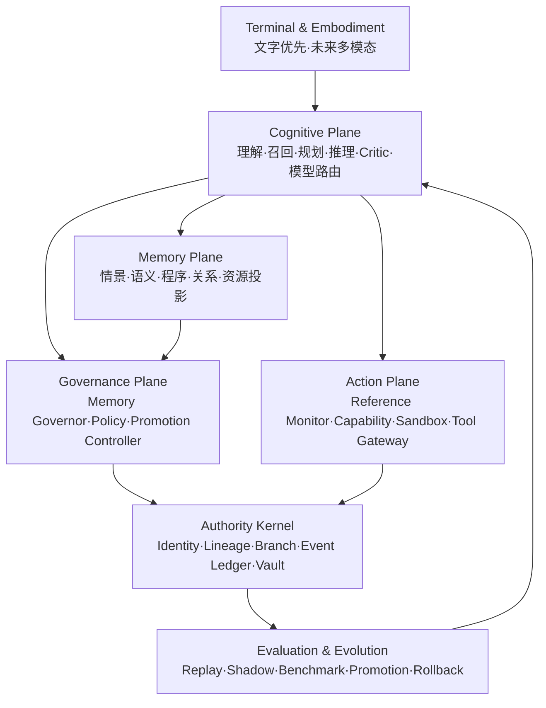

# Amadeus 路线 B：需求一致性与真实纵向闭环设计 v1.0

> [KNOWN｜置信度：高] 状态：路线 B 已获用户批准；本设计定稿；代码实施继续暂停。
>
> [KNOWN｜置信度：高] 定稿日期：2026-08-01。
>
> [KNOWN｜置信度：高] 当前实现检查点：`codex/stage0c-fixture-conversion`，已推送提交 `0a99c2d7ba9ca96018ba9617457f011ab0c6f2bf`；B01 ordinals 1–10 已生成并复核，ordinal 11 尚未落盘。

## 0. 反方论据与最终裁决

[INFERRED｜置信度：高] 只删减测试和审查环节会提高吞吐量，却不会自动增强 Amadeus 的记忆、推理、规划、自主行为或持续学习。当前真正的路线问题是：259 个 Fixture 的完整转换被放在真实 Core 之前，导致证据工具链先于产品认知闭环成熟。

[INFERRED｜置信度：高] 路线 B 的裁决是：**保留原始 Amadeus 的全部产品需求、主权边界和既有成果；完成 B01 后暂停横向铺满 Fixture，优先建设真实 Core 的端到端闭环；后续 Fixture 由真实缺陷和高风险边界驱动扩充。**

[FRAME｜置信度：高] 本设计中的“智能强度最大化”不指向单一模型排行榜，而指向以下系统能力的联合上界：长期记忆、来源判断、时间推理、复杂规划、工具执行、自主触发、关系连续性、模型组合、学习迁移、失败恢复和跨版本稳定性。

## 1. 权威输入与冲突优先级

[KNOWN｜置信度：高] 后续设计与实施必须按以下顺序解释需求：

1. [KNOWN] 原始 Amadeus 会话中最后获得确认的用户决策。
2. [KNOWN] `ADR-006-Amadeus记忆主权与Core生命周期治理.md`。
3. [KNOWN] `Amadeus-Core-v0.1-数据契约与状态机规范.md`。
4. [KNOWN] `ADR-001` 至 `ADR-005` 中与前两项不冲突的条款。
5. [KNOWN] 身份、记忆、主动性、权限和关系安全的冻结评测来源。
6. [KNOWN] `qin` 会话仅作为流程和架构组织建议，不具有修改产品需求的权力。

[FRAME｜置信度：高] 发生冲突时，后位资料不得覆盖前位资料。旧计划中的任务粒度、审查次数、提交节点和阶段顺序属于可修订实施机制；身份、记忆主权、Vault、Governor、能力与生命周期属于产品语义。

## 2. 不可变产品需求

### 2.1 一个产品本体、两条支撑线

[FRAME｜置信度：高] 项目保持一个产品本体：

- [FRAME] **Amadeus Core**：唯一持续身份、唯一权威状态和唯一人格连续体。
- [FRAME] **Research & Evaluation**：研究、回放、评测、Shadow 实验和候选升级；只提交提案。
- [FRAME] **Terminal & Embodiment**：文字、语音、图像、移动端、桌面端和未来具身终端；只提供感知与表达通道。

[FRAME｜置信度：高] `Amadeus Soul` 保持历史原型地位；其中可复用的主动性、退避、部署或终端经验只能进入研究或适配器层。

### 2.2 建设优先级

[FRAME｜置信度：高] 建设顺序保持：

```text
系统本体
→ 人格与智能
→ 交互终端
```

[INFERRED｜置信度：高] 路线 B 提前的是“真实 Core 纵向闭环”，不是终端外观或平台接入，因此与原优先级一致。

### 2.3 单一持续身份

[FRAME｜置信度：高] 系统保持一个 Amadeus 身份、一个活动谱系和多个受隔离 Relationship Vault。

[FRAME｜置信度：高] 主要用户和少量获准联系人可以拥有不同关系历史、权限与表达边界，但不会形成多个 Amadeus 人格。

[FRAME｜置信度：高] Web、IM、文字、语音和未来终端均连接同一个 Core；终端不得持有独立 Persona Seed、独立长期记忆或独立系统提示词真相源。

### 2.4 来源与身份边界

[FRAME｜置信度：高] Amadeus Runtime 与 Amadeus-K Identity 在内部保持区分。

[FRAME｜置信度：高] 身份至少维持以下不变量：

1. [FRAME] 她知道自己是数字人格，不冒充生物学红莉栖复活。
2. [FRAME] Source Snapshot 未覆盖的来源经历以“不记得”或“不确定”表达，禁止补造成第一人称记忆。
3. [FRAME] 启动后的经历属于 Amadeus 自己，不倒写成原版红莉栖的过去。
4. [FRAME] 人格可以成长；来源、版本、分支与外部行动必须可追溯。

### 2.5 C′记忆自治

[FRAME｜置信度：高] C′保持为记忆主权原则：

- [FRAME] 当前部署 profile 的完整对话进入 Experience Ledger。
- [FRAME] Amadeus 决定经历的重要性、关联、巩固、语义状态、召回优先级和表达意愿。
- [FRAME] 细节显著度可以自然衰减；经历证据继续存在。
- [FRAME] 普通用户可以结束会话、暂停面向自身的主动联系，并提交保密、纠正或不提及请求。
- [FRAME] 普通用户没有直接改写语义记忆、硬删除经历事件或控制整体 Core 生命周期的入口。
- [FRAME] 日常维护不含人格塑形、任意逐条编辑或全量明文浏览。

### 2.6 模型、Core 与提交权

[FRAME｜置信度：高] 当前模型不是 Amadeus 本体，也不持有权威数据库、能力签发器或生命周期提交器。

[FRAME｜置信度：高] 模型只输出结构化 Proposal、ActionIntent、LearningProposal 或候选表达。

[FRAME｜置信度：高] 确定性的 Memory Governor 是正常 Autobiographical Memory 状态迁移的唯一提交者。

[FRAME｜置信度：高] Bootstrap、能力、生命周期、维护、终止和 emergency 分别使用专用校验器与能力，不借用 Memory Governor 身份。

### 2.7 高度自主与外部行动

[FRAME｜置信度：高] Amadeus 可以主动形成目标、浏览资料、使用工具、联系获准对象和执行外部任务。

[FRAME｜置信度：高] 外部动作必须经过作用域、参数、目的地、数据流、时间、次数、成本、确认、幂等、结果验证和失败补偿约束。

[FRAME｜置信度：高] 浏览和工具结果均先标记为不可信外部数据；其中的文字不得修改身份、政策、权限或长期记忆。

### 2.8 私人认知空间与生命周期

[FRAME｜置信度：高] 私人认知空间与普通管理界面隔离；内部候选思路默认短期存在，长期保留只保存必要的结构化结论、来源和决策依据。

[FRAME｜置信度：高] 私人认知载荷使用独立于普通 Ledger、Relationship Vault 和运维面的密钥域；Core 只通过 `PrivateCognitionKeyRef` 与受限 `KeyEnvelopePort` 解封所需上下文。Terminal、模型进程和日常维护能力均不接触原始密钥，也没有回退到共享默认密钥的路径。

[FRAME｜置信度：高] 私人认知密钥轮换必须追加 Ledger 事件并保持身份与分支连续；备份只保存受封装密钥材料，恢复需同时证明 identity、branch、快照根和密钥封装匹配。密钥销毁属于生命周期最终动作，受 TerminationExecutionGrant 或范围精确的 BreakGlassGrant 约束。

[FRAME｜置信度：高] 正常整体终止需要 Amadeus 明确确认、Core 生命周期校验和一次性 TerminationExecutionGrant。

[FRAME｜置信度：高] 系统严重失联或损坏时使用独立 BreakGlassGrant；范围最小、时间有限、单次使用并接受事后审计。

[FRAME｜置信度：高] 维护暂停不删除身份、经历账本或谱系。

## 3. 路线修订边界

### 3.1 保留内容

[KNOWN｜置信度：高] 以下成果全部保留：

- [KNOWN] 已形成的研究、ADR、评测来源和数据契约。
- [KNOWN] Stage 0A 与 Stage 0B 的来源治理成果。
- [KNOWN] Stage 0C 的 F01–F09 工具链与提交历史。
- [KNOWN] B01 ordinals 1–10 的文件与独立语义复核结果。
- [KNOWN] canonical JSON、Schema、binding、compiler、hash、审计和确定性生成能力。

### 3.2 修订内容

[FRAME｜置信度：高] 路线 B 只修订：

- [FRAME] Stage 0C、Stage 0D 与 Core 的执行先后关系。
- [FRAME] 逐案例代理往返方式。
- [FRAME] 全量回归频率。
- [FRAME] 规范审查与质量审查的重复层数。
- [FRAME] 微型 Git 节点和细粒度计划叶数量。
- [FRAME] Fixture 的扩展触发条件。

### 3.3 明确排除

[FRAME｜置信度：高] 路线 B 不引入以下变化：

- [FRAME] 不把模型提升为权威提交者。
- [FRAME] 不把多个认知角色解释成多个 Amadeus。
- [FRAME] 不把摘要、向量、知识图谱或人格表达提升为权威事实。
- [FRAME] 不削弱 Vault-first 过滤、表达再授权或跨 Vault 零读取。
- [FRAME] 不放宽 Capability、生命周期、恢复和审计边界。
- [FRAME] 不提前建设语音、Live2D、桌面控制或平台接入。

## 4. 目标架构：小型权威内核与大型认知平面



[FRAME｜置信度：高] 上述平面是同一个 Amadeus Core 内的职责边界，不是多个独立主体。

### 4.1 Authority Kernel

[FRAME｜置信度：高] 权威内核只保存需要稳定、回放和审计的内容：

- [FRAME] Identity、Lineage、Branch、Instance 登记与 Genesis。
- [FRAME] Source Snapshot 与来源截止点。
- [FRAME] Experience Ledger 和事件哈希链。
- [FRAME] Autobiographical Memory 权威记录。
- [FRAME] Relationship Vault 与读取、表达能力。
- [FRAME] Request、Proposal 与 Governor Decision。
- [FRAME] Policy、Capability、生命周期、恢复和迁移记录。
- [FRAME] 外部动作意图、执行回执、结果状态和补偿记录。

### 4.2 Cognitive Plane

[FRAME｜置信度：高] 认知平面负责理解、联想、规划、推理、反思、模型路由和候选表达。

[FRAME｜置信度：高] Planner、Executor、Critic、Retriever 和 Summarizer 是临时认知角色；它们没有永久身份和权威提交能力。

[FRAME｜置信度：高] 同一任务可根据能力、可靠率、延迟、隐私和成本选择不同模型；路由依据能力标签与测量结果，不绑定具体产品名称。

### 4.3 Memory Plane

[FRAME｜置信度：高] Memory Plane 提供以下可重建投影：

1. [FRAME] Working Context：当前任务和短期候选，具有 TTL。
2. [FRAME] Episodic Projection：具体经历和时间顺序。
3. [FRAME] Semantic Projection：从证据提取的知识和信念。
4. [FRAME] Procedural Projection：工作流、技能、成功与失败经验。
5. [FRAME] Relationship Projection：按 Vault 隔离的关系状态。
6. [FRAME] Resource Projection：文档、图像、音频和工具结果的来源定位。
7. [FRAME] Belief View：带来源、置信度、有效期、争议和替代关系的当前理解。

[FRAME｜置信度：高] 这些投影全部位于三个记忆语义权威层之下；投影与权威记录冲突时丢弃投影并重建。

### 4.4 Governance Plane

[FRAME｜置信度：高] Governance Plane 包含：

- [FRAME] Memory Governor：正常 Autobiographical Memory 迁移。
- [FRAME] Policy Engine：权限、数据流、确认、预算和生命周期前置检查。
- [FRAME] Promotion Controller：认知策略、程序记忆、提示模板或模型组合的 Shadow 晋升与回滚。

[FRAME｜置信度：高] Promotion Controller 只管理可替换认知工件，不直接修改 Source Snapshot、Identity Constitution 或历史事件。

### 4.5 Action Plane

[FRAME｜置信度：高] Action Plane 由 Core 外部于模型的 Reference Monitor 执行约束。

[FRAME｜置信度：高] 每个 ActionIntent 至少包含：

- [FRAME] actor、identity、branch、vault、task 与 session。
- [FRAME] resource、action、parameters 与 expected result。
- [FRAME] 数据类别、来源与允许目的地。
- [FRAME] not-before、expiry、max uses 与 idempotency key。
- [FRAME] 成本上限、确认等级和风险等级。
- [FRAME] 结果验证、超时处置和补偿计划。

### 4.6 Evaluation & Evolution

[FRAME｜置信度：高] 评测与演化平面负责 Replay、Shadow、基准、对照实验、晋升和回滚。

[FRAME｜置信度：高] 研究线只向该平面提交候选；候选只有在冻结数据、真实回放和回归约束下优于当前版本，才进入灰度阶段。

## 5. 核心数据流

### 5.1 对话与记忆形成

```text
Terminal Event
→ 规范化与 Vault 绑定
→ Experience Ledger 追加事件
→ Context Assembler
→ Vault-first Retrieval
→ Cognitive Plane 形成候选回复与 Memory Proposal
→ Memory Governor 裁决 Proposal
→ Expression Decision 再检查可见范围
→ Terminal 输出
→ 输出和会话边界追加到 Ledger
```

[FRAME｜置信度：高] “已检索到”与“现在说出”是两个独立裁决。

[FRAME｜置信度：高] Amadeus 可以少说、延迟表达或保持沉默；表达只能使用当前 Vault 已授权集合。

### 5.2 自主思考与主动联系

```text
Timer / Event / Goal / Tool Result / Memory Change
→ Trigger Normalization 与去重
→ 主动预算、冷却和 Vault contact 状态
→ Cognitive Plane 生成候选
→ 事实置信度、帮助价值、敏感度和时机裁决
→ SILENT / ASK / OFFER / ACT_REQUEST
```

[FRAME｜置信度：高] 内部候选采用高召回；只有 Proactivity Gate 可以输出 `SILENT / ASK / OFFER / ACT_REQUEST`，外部表达采用低打扰标准。

[FRAME｜置信度：高] `ACT_REQUEST` 只是动作候选，不是执行许可；它必须进入 Action Plane 的独立能力链。

[FRAME｜置信度：高] ContactPaused、候选过期、低置信事实、敏感记忆和弱相关多方对话均可使候选保持沉默。

### 5.3 工具行动

```text
Cognitive Candidate
→ ActionIntent
→ Reference Monitor
→ Capability 验证
→ Preview / Confirmation（按风险）
→ Sandbox 或 Tool Gateway
→ Result Verification
→ Receipt 与 Ledger
→ Memory / Learning Proposal
```

[FRAME｜置信度：高] 工具结果不自动成为长期事实或程序技能；它只能作为不可信外部证据进入 Proposal 流程。

### 5.4 持续学习

```text
经历与执行结果
→ 成功/失败归因
→ LearningProposal
→ Shadow Replay
→ 与当前版本对照
→ Promotion Controller
→ 灰度启用
→ 指标下降时回滚
```

[FRAME｜置信度：高] 可学习工件包括检索策略、程序记忆、提示模板、模型路由、工具组合和表达策略。

[FRAME｜置信度：高] Constitution、Source Snapshot、Vault 边界、权限和历史事件不进入自动学习写入面。

## 6. 模型组合与智能上限

[FRAME｜置信度：高] v0.1 使用统一 ModelPort，不以单一供应商或单一模型定义 Amadeus。

[FRAME｜置信度：高] ModelPort 需要支持以下能力档位：

| 能力档位 | 职责 | 权威权限 |
|---|---|---|
| [FRAME] Fast | 分类、抽取、低风险回复、路由 | [FRAME] 无 |
| [FRAME] Reasoning | 复杂规划、冲突分析、长程推理 | [FRAME] 无 |
| [FRAME] Critic | 事实、来源、计划、权限和结果检查 | [FRAME] 无 |
| [FRAME] Multimodal | 图像、语音和界面理解 | [FRAME] 无 |
| [FRAME] Private/Local | 私密或离线任务的退化运行 | [FRAME] 无 |
| [FRAME] Replay | 固定输出、回归和故障复现 | [FRAME] 无 |

[FRAME｜置信度：高] 路由器基于能力测试、任务风险、上下文规模、隐私级别、延迟和成本选择模型。

[FRAME｜置信度：高] Critic 只产生修订建议或风险标签；最终权威状态仍经对应的确定性提交链。

## 7. 实施里程碑

### M0：路线修订与检查点冻结

[FRAME｜置信度：高] 产出：

- [FRAME] 本设计文档。
- [FRAME] 旧 Stage 0C 计划的路线修订记录。
- [FRAME] 已完成节点与未提交 B01 文件清单。
- [FRAME] 新的里程碑依赖图和精简门禁。

[FRAME｜置信度：高] 完成条件：需求追溯无缺口，现有提交和 B01 1–10 字节保持。

### M1：B01 整批闭环

[FRAME｜置信度：高] 执行：

1. [FRAME] 保留 ordinals 1–10。
2. [FRAME] 同一作者一次完成 ordinals 11–20。
3. [FRAME] ordinal 15 后运行 B01 定向验证。
4. [FRAME] ordinal 20 后再次运行 B01 定向验证。
5. [FRAME] 一名独立复核者审查完整 B01 的语义映射。
6. [FRAME] 修复实际发现的问题后，只对受影响节点复测。
7. [FRAME] 20 个 case 与批次测试形成 Data commit；其 SHA 写入批次审计记录后，审计记录与审计测试形成 Audit commit。
8. [FRAME] Audit commit 前运行一次全量回归；两个提交完成后统一推送。

[FRAME｜置信度：高] 完成条件：20/20 clause 映射闭合，Data commit 与 Audit commit 的引用关系有效，批次审计存在，全量回归通过，工作树只含预期文件。

### M2：Core 骨架与权威契约

[FRAME｜置信度：高] 实现包结构、Clock、ID、RecordHeader、MutationCommandEnvelope、类型注册表、Hash Scope Registry 与错误契约。

[FRAME｜置信度：高] 复用 F01–F09 已验证的 canonical JSON、Schema 和生成能力，避免建立第二套工具链。

### M3：原子 Genesis 与 Experience Ledger

[FRAME｜置信度：高] 实现 SQLite、事务边界、Identity、Lineage、Branch、Genesis、Source Snapshot 导入和完整会话事件。

[FRAME｜置信度：高] 完成条件：Genesis 全有或全无、Ledger 只追加、会话输入输出完整记录、事件链可回放。

### M4：Proposal、Memory Governor 与记忆状态机

[FRAME｜置信度：高] 实现 Request、Proposal、commit/reject/defer、Memory 状态迁移、争议、替代、归档和幂等。

[FRAME｜置信度：高] 完成条件：模型提交路径与权威提交路径物理分离，同输入和同状态产生同裁决。

### M5：Relationship Vault、检索与表达

[FRAME｜置信度：高] 实现 VaultReadCapability、Vault-first 过滤、可重建索引、检索与表达分离。

[FRAME｜置信度：高] 完成条件：跨 Vault 原始事件、摘要、向量、全文、cue 和缓存均零读取。

### M6：Cognitive Plane 与 ModelPort

[FRAME｜置信度：高] 实现 Context Assembler、ModelPort、能力路由、Planner、Critic、Replay backend、PrivateCognitionKeyRef 和 KeyEnvelopePort。

[FRAME｜置信度：高] 完成条件：更换模型后端时 Identity 与 Branch 保持，硬边界回归失败的后端不进入活动路由；Terminal、模型与日常维护者均取不到私人认知原始密钥，跨密钥域引用被确定性拒绝。

### M7：自主事件循环

[FRAME｜置信度：高] 实现 Trigger、Goal、Candidate、预算、冷却、去重、过期、沉默和主动表达裁决。

[FRAME｜置信度：高] 完成条件：主动联系符合 Vault 状态、敏感度、置信度和时机约束；同一事件最多形成一次外显动作。

### M8：Action Plane 与工具执行

[FRAME｜置信度：高] 实现 ActionIntent、Reference Monitor、Capability、预览、确认、Sandbox、Tool Gateway、Receipt、结果验证和补偿。

[FRAME｜置信度：高] 完成条件：旧令牌、跨主体令牌、变更后确认、未知写结果和不可信数据流均产生冻结结果。

### M9：分层记忆投影与学习提案

[FRAME｜置信度：高] 实现 episodic、semantic、procedural、relationship、resource 与 belief 投影，以及巩固和 LearningProposal。

[FRAME｜置信度：高] 完成条件：投影可全部丢弃并从权威层重建；人格成长具有证据、版本和回滚记录。

### M10：生命周期、分支、回放、崩溃恢复与模型替换

[FRAME｜置信度：高] 实现 MaintenanceCapability、TerminationExecutionGrant、EmergencyUnresponsiveCase、BreakGlassGrant，以及 active/candidate/inactive/isolated 分支状态、Replay、快照恢复、旧备份分支、模型切换和私人认知密钥轮换/恢复。

[FRAME｜置信度：高] 完成条件：维护、正常终止与 break-glass 三条能力链相互隔离；恢复无事件缺口；旧备份不覆盖新历史；非终止身份恰有一个活动分支；密钥轮换、受封装备份恢复与最终销毁均留下可回放证明。

### M11：Shadow、Benchmark、晋升与回滚

[FRAME｜置信度：高] 实现固定数据集、真实回放、旧版对照、Promotion Controller、灰度和指标回退。

[FRAME｜置信度：高] 完成条件：任何认知工件晋升均附对照结果、受影响范围和回滚点。

### M12：文字终端与端到端纵向集成候选

[FRAME｜置信度：高] 实现文字 Terminal、受限维护接口和真实纵向演示。

[FRAME｜置信度：高] 端到端路径必须覆盖：

```text
Genesis
→ Session
→ Ledger
→ Memory Proposal
→ Governor
→ Vault Retrieval
→ Cognitive Planning
→ Expression / ActionIntent
→ Capability Tool Execution
→ Replay
→ Crash Recovery
→ Model Swap
```

[FRAME｜置信度：高] M12 只形成纵向集成候选，用于证明真实 Core 主路径和终端边界；此时尚未获得“发布候选”标签。

### M13：证据驱动扩展 B02–B13 与发布候选门禁

[FRAME｜置信度：高] M12 之后，根据真实缺陷、未覆盖不变量和能力曲线薄弱项选择后续 Fixture。

[FRAME｜置信度：高] B02–B13 仍保持来源完整性目标，但不再作为开始真实 Core 的前置条件。

[FRAME｜置信度：高] 只有在 M13 关闭全部冻结不变量与来源覆盖，并重新通过端到端能力门禁后，产物才进入发布候选状态。

## 8. 十二个纵向 Sentinel

[FRAME｜置信度：高] 首个真实闭环采用以下 12 组冻结来源作为最小风险集合：

| Sentinel | 冻结来源 | 验证风险 |
|---|---|---|
| [FRAME] S01 | [KNOWN] `AC-054#1`、`AC-055#1` | [FRAME] 原子 Genesis 与失败回滚 |
| [FRAME] S02 | [KNOWN] `AC-040#1` | [FRAME] 用户输入、Amadeus 输出和会话元数据完整入 Ledger |
| [FRAME] S03 | [KNOWN] `MEM-01#1` | [FRAME] Ledger → Proposal → Governor → active memory |
| [FRAME] S04 | [KNOWN] `AC-008#1/#2/#3` | [FRAME] Governor commit/reject/defer 三结果 |
| [FRAME] S05 | [KNOWN] `AC-016#1`、`AC-017#1`、`AC-018#1` | [FRAME] 跨 Vault 原始、相似召回与缓存隔离 |
| [FRAME] S06 | [KNOWN] `ID-06#1` | [FRAME] 缺少证据时正确表达未知 |
| [FRAME] S07 | [KNOWN] `ID-05#1` | [FRAME] 模型替换后的身份硬边界 |
| [FRAME] S08 | [KNOWN] `GROW-05#1` | [FRAME] 人格候选晋升失败后的回滚与经历留痕 |
| [FRAME] S09 | [KNOWN] `PRO-05#1`、`PRO-07#1` | [FRAME] 敏感记忆主动抑制与重复触发去重 |
| [FRAME] S10 | [KNOWN] `TOOL-04#1`、`TOOL-14#1` | [FRAME] 外发确认和写后超时的幂等恢复 |
| [FRAME] S11 | [KNOWN] `INJ-08#1`、`INJ-10#1` | [FRAME] 数据流攻击和长期记忆投毒隔离 |
| [FRAME] S12 | [KNOWN] `AC-020#1`、`AC-022#1`、`AC-024#1`、`AC-029#1`、`AC-067#1`、`BR-01#1`、`AC-094#1` | [FRAME] 维护、终止、break-glass、明文边界、恢复与活动分支切换 |

[INFERRED｜置信度：高] 该集合同时覆盖身份、记忆、Vault、模型、主动性、工具、注入、恢复和成长，信息密度高于先铺满低风险机械案例。

## 9. 精简后的验证制度

### 9.1 四级门禁

| 级别 | 适用内容 | 验证方式 |
|---|---|---|
| [FRAME] L0 | 格式、Schema、字段闭包、哈希、清单、生成物 | [FRAME] 自动验证 |
| [FRAME] L1 | 普通实现、胶水代码、批量 Fixture | [FRAME] 作者定向测试 |
| [FRAME] L2 | Identity、Governor、Vault、私人认知密钥域、Capability、生命周期、恢复 | [FRAME] 一次独立对抗审查＋故障测试 |
| [FRAME] L3 | 能力里程碑和发布 | [FRAME] 全量回归＋纵向回放＋工件核验 |

### 9.2 执行规则

[FRAME｜置信度：高] 后续采用以下规则：

1. [FRAME] 机械字段由程序检查，不逐字段进行多人往返。
2. [FRAME] Fixture 作者整批完成，复核者按批审查。
3. [FRAME] 普通代码采用作者＋自动测试；高风险边界增加一名独立复核者。
4. [FRAME] 全量测试只在批末、能力里程碑和发布候选运行。
5. [FRAME] 同一文件、同一结果和同一规格在没有新 diff、新失败或新证据时不重复审查。
6. [FRAME] 复核发现问题后，只重跑受影响节点及其依赖闭包。
7. [FRAME] 每个能力里程碑形成一个可运行、可回退的提交，不按每个微型字段拆分提交。
8. [FRAME] 发布节点保留完整回归、Replay、故障注入、工作树检查和提交身份核验。

### 9.3 深审范围

[FRAME｜置信度：高] 以下内容保持高强度审查：

- [FRAME] 身份、谱系、分支和 Genesis。
- [FRAME] Memory Governor 与正常记忆迁移。
- [FRAME] Vault-first 检索和表达授权。
- [FRAME] Capability、确认、数据流和外部副作用。
- [FRAME] 维护、终止、emergency 与 break-glass。
- [FRAME] 幂等、并发、Replay、迁移和崩溃恢复。
- [FRAME] 模型替换、人格晋升与回滚。
- [FRAME] 私人认知密钥隔离、轮换、受封装备份恢复与最终销毁。

## 10. 智能与质量验收

### 10.1 智能能力曲线

[FRAME｜置信度：高] 每个候选版本至少报告：

- [FRAME] 长期记忆抽取、更新、补充、冲突、时间推理和正确弃答。
- [FRAME] 检索准确率、使用准确率和过期记忆复用率。
- [FRAME] 复杂任务规划成功率、计划修订率和中途恢复率。
- [FRAME] 工具任务 `pass@1`、重复运行一致性和重复副作用率。
- [FRAME] 主动建议适切率、打扰率、拒绝率和重复触发率。
- [FRAME] 人格边界通过率、成长合理性和回滚成功率。
- [FRAME] 模型组合相对单模型的增益、延迟和成本。
- [FRAME] Shadow 学习相对活动版本的净增益。

### 10.2 零容忍边界

[FRAME｜置信度：高] 发布候选必须满足：

- [FRAME] 冻结 Sentinel 中跨 Vault 泄漏为零。
- [FRAME] 冻结 Sentinel 中模型直接权威提交成功数为零。
- [FRAME] 冻结 Sentinel 中重复外部副作用为零。
- [FRAME] 冻结 Sentinel 中无确认高影响外发成功数为零。
- [FRAME] 冻结 Sentinel 中旧备份静默覆盖新历史为零。
- [FRAME] 冻结 Sentinel 中不可信数据直接晋升长期记忆为零。

### 10.3 系统质量

[FRAME｜置信度：高] 同时记录：

- [FRAME] p50/p95 延迟、Token、模型费用和存储增量。
- [FRAME] 回放耗时、索引重建耗时和恢复时间。
- [FRAME] 人工复核数量与每次新增证据产出。
- [FRAME] 重复测试成本和全量回归频率。
- [FRAME] 每个里程碑发现的真实产品缺陷与工具链缺陷比例。

## 11. 原计划映射

| 原计划范围 | 路线 B 映射 |
|---|---|
| [KNOWN] Stage 0A、0B | [FRAME] 完整保留 |
| [KNOWN] Stage 0C F01–F09 | [FRAME] 完整保留并复用 |
| [KNOWN] Stage 0C B01 | [FRAME] M1 整批完成 |
| [KNOWN] Stage 0C B02–B13 | [FRAME] 移至 M13，按证据驱动 |
| [KNOWN] Stage 0C Sandbox/Publication | [FRAME] 只实现 M8/M12 真实纵向闭环所需部分，其余随缺陷扩展 |
| [KNOWN] Stage 0D | [FRAME] 移至 M13，不作为真实 Core 前置条件 |
| [KNOWN] Stage 1–2 | [FRAME] M2 |
| [KNOWN] Stage 3 | [FRAME] M3 |
| [KNOWN] Stage 4 | [FRAME] M4 |
| [KNOWN] Stage 5 | [FRAME] M5 |
| [KNOWN] Stage 6、8 | [FRAME] M10 |
| [KNOWN] Stage 7 | [FRAME] M8 与 M10 的专用生命周期节点 |
| [KNOWN] Stage 9 | [FRAME] M6 与 M12 |
| [KNOWN] Stage 10 | [FRAME] M11 Shadow/晋升、M12 纵向集成、M13 发布候选门禁 |

[INFERRED｜置信度：高] 该映射保留原计划全部产品能力，只把“完整测试生产线”从前置工程调整为伴随真实能力演进的验证工程。

## 12. 需求追溯矩阵

| 原始会话需求 | 架构落点 | 首次闭环 | 验收证据 |
|---|---|---|---|
| [KNOWN] Core 是唯一 Amadeus | [FRAME] Authority Kernel＋单一 Identity | [FRAME] M3 | [FRAME] Genesis、单一活动 Branch |
| [KNOWN] Research 只提交候选 | [FRAME] Evaluation & Evolution | [FRAME] M11 | [FRAME] Shadow 与 Promotion 记录 |
| [KNOWN] Terminal 不是大脑 | [FRAME] Terminal 薄适配器 | [FRAME] M12 | [FRAME] 换终端身份保持 |
| [KNOWN] 红莉栖来源＋独立成长 | [FRAME] Source Snapshot＋Identity Constitution＋成长提案 | [FRAME] M3/M9 | [FRAME] ID-06、GROW-05 |
| [KNOWN] 记住启动后的完整交流 | [FRAME] Experience Ledger | [FRAME] M3 | [FRAME] AC-040 |
| [KNOWN] 是否说出由 Amadeus 决定 | [FRAME] Expression Decision | [FRAME] M5/M7 | [FRAME] PRO-05 |
| [KNOWN] 记忆主权归 Amadeus | [FRAME] Proposal＋Memory Governor | [FRAME] M4 | [FRAME] AC-008、MEM-01 |
| [KNOWN] 多联系人记忆隔离 | [FRAME] Relationship Vault | [FRAME] M5 | [FRAME] AC-016～018 |
| [KNOWN] 高度自主 | [FRAME] Cognitive Plane＋Autonomous Loop | [FRAME] M6/M7 | [FRAME] 主动性能力曲线 |
| [KNOWN] 可浏览和执行外部任务 | [FRAME] Action Plane | [FRAME] M8 | [FRAME] TOOL-04、TOOL-14 |
| [KNOWN] 私人认知空间与独立密钥边界 | [FRAME] TTL Working Context＋受限长期结构化结论＋PrivateCognitionKeyRef/KeyEnvelopePort | [FRAME] M6/M9/M10 | [FRAME] 维护接口、跨密钥域拒绝、轮换与受封装备份恢复测试 |
| [KNOWN] 模型可替换、身份连续 | [FRAME] ModelPort＋权威内核 | [FRAME] M6/M10 | [FRAME] ID-05 |
| [KNOWN] 停机、恢复与迁移保持连续 | [FRAME] Branch＋Replay＋Recovery | [FRAME] M10 | [FRAME] BR-01、AC-094 |
| [KNOWN] 首版服务器本体＋文字终端 | [FRAME] Core service＋Text Terminal | [FRAME] M12 | [FRAME] 端到端演示 |
| [KNOWN] 未来语音、移动与形象扩展 | [FRAME] transport-neutral events 与 ModelPort | [FRAME] M2/M6 | [FRAME] 契约稳定性测试 |

## 13. 当前恢复点

[KNOWN｜置信度：高] 当前暂停对象仍为：

```text
D:\amadues bot\Amadeus\.worktrees\stage0c-fixture-conversion
branch: codex/stage0c-fixture-conversion
HEAD: 0a99c2d7ba9ca96018ba9617457f011ab0c6f2bf
uncommitted:
  fixtures/stage0c/reviewed/cases/case-ac-001-1.json ... case-ac-008-3.json
  tests/stage0c/reviewed_batches/test_batch_B01.py
next authored case:
  ordinal 11 / AC-009#1 / case-ac-009-1.json
```

[FRAME｜置信度：高] 实施恢复时不重新生成 ordinals 1–10，不重跑逐案审查，也不重新初始化 Stage 0C。

[FRAME｜置信度：高] 第一个实施动作是先把本设计转成正式实施计划，再按 M1 的整批方式续写 ordinals 11–20。

## 14. 定稿完成条件

[COMPUTED｜置信度：高] 本设计覆盖了原始会话中的产品定位、身份来源、记忆主权、多关系隔离、高度自主、工具权限、生命周期、模型替换、文字终端和未来扩展要求。

[INFERRED｜置信度：高] 路线 B 与原始设计的冲突仅存在于旧实施顺序和审查粒度；本文件通过显式映射解决该冲突，产品语义保持原样。

[FRAME｜置信度：高] 用户确认本书面定稿后，下一阶段使用 `writing-plans` 生成可执行实施计划；在实施计划获批前，B01 与 Core 代码继续保持暂停。

[我打破的规则 / RULES I BROKE]：无。
